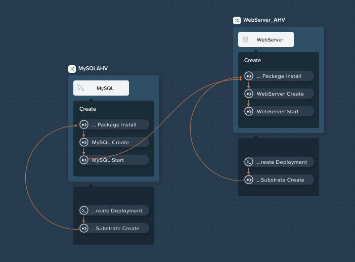
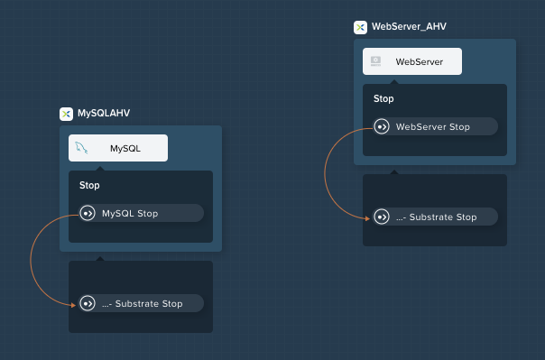

.. _calm_lamp_blueprint:

-----------------------------
Calm: 3-Tier WebApp Blueprint
-----------------------------

Overview
++++++++

Calm Blueprint (3TWA)
+++++++++++++++++++++

In this exercise you will extend the MySQL Blueprint created previously into a basic 3 Tier Web Application (a Task Manager), as shown below.  You'll also add the ability to perform Day 2 operations (scaling) to the blueprint.

We'll use a Cloud based CentOS image which does not allow password based authentication, instead it relies on *SSH keys*.  Most Public Clouds authenticate in this manner.

.. figure:: images/5103twa1.png

Creating the Web Server
.......................

From **Prism Central > Calm** (if you're running 5.8.1 or later), select **Blueprints** from the sidebar.

In **Application Overview > Services**, click :fa:`plus-circle`.

Note **Service2** appears in the **Workspace** and the **Configuration Pane** reflects the configuration of the selected Service. You can rearrange the Service icons on the Workspace by clicking and dragging them.

With the WebServer service icon selected in the workspace window, scroll to the top of the **Configuration Panel**, click **VM**.

- **Service Name** - WebServer
- **Name** - WebServer\_AHV
- **Cloud** - Nutanix
- **OS** - Linux
- **VM Name** - WebServer-@@{calm\_array\_index}@@-@@{calm\_time}@@
- **Image** - CentOS\_7\_Cloud
- **Device Type** - Disk
- **Device Bus** - SCSI
- Select **Bootable**
- **vCPUs** - 2
- **Cores per vCPU** - 1
- **Memory (GiB)** - 4
- **Guest Customization** - Select Guest Customization

    - Leave **Cloud-init** selected and paste in the following script

      .. code-block:: bash

        #cloud-config
        users:
          - name: centos
            ssh-authorized-keys:
              - @@{INSTANCE_PUBLIC_KEY}@@
            sudo: ['ALL=(ALL) NOPASSWD:ALL']

- Select :fa:`plus-circle` under **Network Adapters (NICs)**
- **NIC** - Primary
- **Credential** - CENTOS

Click **Save** and ensure no errors or warnings pop-up.  If they do, resolve the issue, and **Save** again.

With the WebServer service icon selected in the workspace window, scroll to the top of the **Configuration Panel**, click **Package**.  Name the Package as **WebServer_PACKAGE**, and then click the **Configure install** button.

On the Blueprint Canvas section, a **Package Install** field will pop up next to the WebServer Service tile.  Click on the **+ Task** button, and fill out the following fields on the **Configuration Panel** on the right:

- **Name Task** - Install_WebServer
- **Type** - Execute
- **Script Type** - Shell
- **Credential** - CENTOS

Copy and paste the following script into the **Script** field:

.. code-block:: bash

  #!/bin/bash
  set -ex

  sudo yum update -y
  sudo yum -y install epel-release
  sudo setenforce 0
  sudo sed -i 's/enforcing/disabled/g' /etc/selinux/config /etc/selinux/config
  sudo systemctl stop firewalld || true
  sudo systemctl disable firewalld || true
  sudo rpm -Uvh https://mirror.webtatic.com/yum/el7/webtatic-release.rpm
  sudo yum update -y
  sudo yum install -y nginx php56w-fpm php56w-cli php56w-mcrypt php56w-mysql php56w-mbstring php56w-dom git unzip

  sudo mkdir -p /var/www/laravel
  echo "server {
   listen 80 default_server;
   listen [::]:80 default_server ipv6only=on;
  root /var/www/laravel/public/;
   index index.php index.html index.htm;
  location / {
   try_files \$uri \$uri/ /index.php?\$query_string;
   }
   # pass the PHP scripts to FastCGI server listening on /var/run/php5-fpm.sock
   location ~ \.php$ {
   try_files \$uri /index.php =404;
   fastcgi_split_path_info ^(.+\.php)(/.+)\$;
   fastcgi_pass 127.0.0.1:9000;
   fastcgi_index index.php;
   fastcgi_param SCRIPT_FILENAME \$document_root\$fastcgi_script_name;
   include fastcgi_params;
   }
  }" | sudo tee /etc/nginx/conf.d/laravel.conf
  sudo sed -i 's/80 default_server/80/g' /etc/nginx/nginx.conf
  if `grep "cgi.fix_pathinfo" /etc/php.ini` ; then
   sudo sed -i 's/cgi.fix_pathinfo=1/cgi.fix_pathinfo=0/' /etc/php.ini
  else
   sudo sed -i 's/;cgi.fix_pathinfo=1/cgi.fix_pathinfo=0/' /etc/php.ini
  fi

  sudo systemctl enable php-fpm
  sudo systemctl enable nginx
  sudo systemctl restart php-fpm
  sudo systemctl restart nginx

  if [ ! -e /usr/local/bin/composer ]
  then
   curl -sS https://getcomposer.org/installer | php
   sudo mv composer.phar /usr/local/bin/composer
   sudo chmod +x /usr/local/bin/composer
  fi

  sudo git clone https://github.com/ideadevice/quickstart-basic.git /var/www/laravel
  sudo sed -i 's/DB_HOST=.*/DB_HOST=@@{MySQL.address}@@/' /var/www/laravel/.env

  sudo su - -c "cd /var/www/laravel; composer install"
  if [ "@@{calm_array_index}@@" == "0" ]; then
   sudo su - -c "cd /var/www/laravel; php artisan migrate"
  fi

  sudo chown -R nginx:nginx /var/www/laravel
  sudo chmod -R 777 /var/www/laravel/
  sudo systemctl restart nginx

Select the WebServer service icon in the workspace window again and scroll to the top of the **Configuration Panel**, click **Package**.

Fill out the following fields:

- **Click** - Configure uninstall
- **Click** - + Task
- **Name Task** - Uninstall_WebServer
- **Type** - Execute
- **Script Type** - Shell
- **Credential** - CENTOS

Copy and paste the following script into the **Script** field:

.. code-block:: bash

  #!/bin/bash
  set -ex

  sudo rm -rf /var/www/laravel
  sudo yum erase -y nginx

Click **Save** and ensure no errors or warnings pop-up.  If they do, resolve the issue, and **Save** again.

Adding Dependencies
...................

As our application will require the database to be running before the web server starts, our Blueprint requires a dependency to enforce this ordering.  There are a couple of ways to do this, one of which we've already done without likely realizing it.  If you didn't save after the last step, be sure to do that first.

In the **Application Overview > Application Profile** section, expand the **Default** Application Profile (if you renamed the Application Profile at a previous step, then just select that re-named application profile).  Next, click on the **Create** Profile Action and view the **Workspace**:

Take note of the **Orange Orchestration Edge** going from the **MySQL Start** task to the **WebServer Package Install** task.  This edge was automatically created by Calm due to the **@@{MySQL.address}@@** macro reference in the **WebServer Package Install** task.  Since the system needs to know the IP Address of the MySQL service prior to being able to proceed with the WebServer Install task, it automatically creates the orchestration edge.  This requires the MySQL service to be started prior to moving on to the WebServer Install task.

Next, back in the **Application Overview > Application Profile** section, select the **Stop** Profile Action.  View the **Workplace** section: notice how there are no orange orchestration edges?  This could cause issues if the MySQL service shutdown slightly before the WebServer accepted a request.  Click on each Profile Action to take note of the current presence (or lack thereof) of the orange orchestration edges.

To resolve this, we'll manually create a dependency.  In the **Workspace**, select the **WebServer** Service and click the **Create Dependency** icon that appears above the Service icon, and then click on the **MySQL** service.  This represents that the **WebServer** service "depends" upon the **MySQL** service, meaning the **MySQL** service will start before, and stop after, the **WebServer** service.

Click **Save**.  You should see the system draw an **Orange Orchestration Edge** like so:

.. figure:: images/510dependency3.png

Drawing the white dependency arrows will cause Calm to create orange orchestration edges for all **System Defined Profile Actions** (Create, Start, Restart, Stop, Delete, and Soft Delete).  Click on each Profile Action to see the difference compared to before the white dependency arrow was drawn.

Adding Replicas
...............

Calm makes it simple to add multiple copies of a given Service, which is helpful for scale out workloads such as web servers.

In the **Workspace**, select the **WebServer** Service.

In the **Configuration Pane**, select the **Service** tab.

Under **Deployment Config**, change the **Min** number of replicas from 1 to 2, and the **Max** Number of replicas from 1 to 4.

.. figure:: images/510replicas.png

Creating the Load Balancer
..........................

To take advantage of a scale out web tier our application needs to be able to load balance connections across multiple web server VMs. HAProxy is a free, open source TCP/HTTP load balancer used to distribute workloads across multiple servers. It can be used in small, simple deployments and large web-scale environments such as GitHub, Instagram, and Twitter.

In **Application Overview > Services**, click :fa:`plus-circle`.

Select **Service3** and fill out the following fields in the **Configuration Pane**:

- **Service Name** - HAProxy
- **Name** - HAPROXYAHV
- **Cloud** - Nutanix
- **OS** - Linux
- **VM Name** - HAProxy-@@{calm\_array\_index}@@-@@{calm\_time}@@
- **Image** - CentOS\_7\_Cloud
- **Device Type** - Disk
- **Device Bus** - SCSI
- Select **Bootable**
- **vCPUs** - 2
- **Cores per vCPU** - 1
- **Memory (GiB)** - 4
- **Guest Customization** - Select Guest Customization

    - Leave **Cloud-init** selected and paste in the following script

      .. code-block:: bash

        #cloud-config
        users:
          - name: centos
            ssh-authorized-keys:
              - @@{INSTANCE_PUBLIC_KEY}@@
            sudo: ['ALL=(ALL) NOPASSWD:ALL']

- Select :fa:`plus-circle` under **Network Adapters (NICs)**
- **NIC** - Primary
- **Credential** - CENTOS

Scroll to the top of the **Configuration Panel**, click **Package**.

Fill out the following fields:

- **Package Name** - HAPROXY_PACKAGE
- **Click** - Configure install
- **Click** - + Task
- **Name Task** - install_haproxy
- **Type** - Execute
- **Script Type** - Shell
- **Credential** - CENTOS

Copy and paste the following script into the **Script** field:

.. code-block:: bash

  #!/bin/bash
  set -ex

  sudo yum update -y
  sudo yum install -y haproxy
  sudo setenforce 0
  sudo sed -i 's/enforcing/disabled/g' /etc/selinux/config /etc/selinux/config
  sudo systemctl stop firewalld || true
  sudo systemctl disable firewalld || true

  echo "global
   log 127.0.0.1 local0
   log 127.0.0.1 local1 notice
   maxconn 4096
   quiet
   user haproxy
   group haproxy
  defaults
   log global
   mode http
   retries 3
   timeout client 50s
   timeout connect 5s
   timeout server 50s
   option dontlognull
   option httplog
   option redispatch
   balance roundrobin
  # Set up application listeners here.
  listen admin
   bind 127.0.0.1:22002
   mode http
   stats uri /
  frontend http
   maxconn 2000
   bind 0.0.0.0:80
   default_backend servers-http
  backend servers-http" | sudo tee /etc/haproxy/haproxy.cfg

  hosts=$(echo "@@{WebServer.address}@@" | tr "," "\n")
  port=80

  for host in $hosts
    do echo " server host-${host} ${host}:${port} weight 1 maxconn 100 check" | sudo tee -a /etc/haproxy/haproxy.cfg
  done

  sudo systemctl daemon-reload
  sudo systemctl enable haproxy
  sudo systemctl restart haproxy

Select the HAProxy service icon in the workspace window again and scroll to the top of the **Configuration Panel**, click **Package**.

Fill out the following fields:

- **Click** - Configure uninstall
- **Click** - + Task
- **Name Task** - uninstall_haproxy
- **Type** - Execute
- **Script Type** - Shell
- **Credential** - CENTOS

Copy and paste the following script into the **Script** field:

.. code-block:: bash

  #!/bin/bash
  set -ex

  sudo
  yum -y erase haproxy

Click **Save**.

In the **Workspace**, select the **HAProxy** Service and click the **Create Dependency** icon that appears above the Service icon.  Select the **WebServer** Service.

Click **Save** and ensure no errors or warnings pop-up.  If they do, resolve the issue, and **Save** again.

Launching and Managing the Application
......................................

Within the blueprint editor, click **Launch**. Specify a unique **Application Name** (e.g. Calm3TWA-*Initials*-2) and click **Create**.

Monitor the application as it deploys. Once the application changes into a **RUNNING** state, navigate to the **Services** tab and select the **HAProxy** service.

On the panel that pops open on the right, highlight and copy the **IP Address** field.

In a new browser tab or window, navigate to http://<HAProxy-IP>, and test out your Task Manager Web Application.

.. figure:: images/5103twa2.png

Takeaways
+++++++++

- Applications typically span across multiple VMs, each responsible for different services. Calm is capable of automated and orchestrating full applications.
- Dependencies between services can be easily modeled in the Blueprint Editor.
- Users can quickly provision entire application stacks for production or testing for repeatable results without time lost to manual configuration.

.. |proj-icon| image:: ../images/projects_icon.png
.. |mktmgr-icon| image:: ../images/marketplacemanager_icon.png
.. |mkt-icon| image:: ../images/marketplace_icon.png
.. |bp-icon| image:: ../images/blueprints_icon.png
