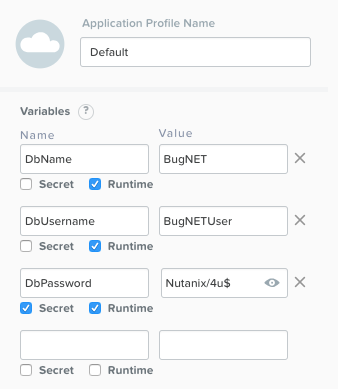

.. _calm_win_tiered_app

--------------------------------
Calm: Windows Tiered Application
--------------------------------

Overview
++++++++

This lab will walk through creating a blueprint which models a tiered Windows Application, which uses MSSQL for the backend, and MSIIS and Web PI for the frontend.  Launching the blueprint will result in a fully function bug tracking application called BugNET.  This lab does assume familiarity with Nutanix Calm.

Creating the Blueprint
......................

From within Nutanix Calm, navigate to the **Blueprint** section, click **+ Create Blueprint**, and select **Multi VM/Pod Blueprint**.

.. figure:: images/create_blueprint.png

In the pop-up, fill in the following three fields, and click **Proceed**:

- **Name** - WindowsTieredApp<Initials>
- **Description** - \* \[BugNET\]\(http://@@{MSIIS.address}@@/bugnet\)
- **Project** - Calm

.. figure:: images/name_blueprint.png

Credentials, Configuration, and Variables
.........................................

Along the top of the blueprint, click on **Credentials**, and then click the blue **+** to create the following two credentials:

+---------------------+---------------------+---------------------+
| **Credential Name** | WIN_VM_CRED         | SQL_CRED            |
+---------------------+---------------------+---------------------+
| **Username**        | administrator       | administrator       |
+---------------------+---------------------+---------------------+
| **Secret Type**     | Password            | Password            |
+---------------------+---------------------+---------------------+
| **Password**        | nutanix/4u          | Str0ngSQL/4u$       |
+---------------------+---------------------+---------------------+

.. figure:: images/credentials.png

Click **Back**, then select the **Configuration** link at the top, click the blue **+** next to the **Downloadable Image Configuration**, and fill in the following fields:

- **Package Name** - MSSQL2014_ISO
- **Description** - Microsoft SQL 2014 Installation ISO
- **Image Name** - MSSQL2014.iso
- **Image Type** - ISO Image
- **Architecture** - X86_64
- **Source URI** - http://download.microsoft.com/download/7/9/F/79F4584A-A957-436B-8534-3397F33790A6/SQLServer2014SP3-FullSlipstream-x64-ENU.iso
- **Product Name** - MSSQL
- **Product Version** - 2014
- **Checksum Algorithm** - Leave blank
- **Checksum Value** - Leave blank

.. figure:: images/downloadable_image_config.png

Click **Back**, and fill in the following variables under the Default Application Profile on the right pane:

+---------------------+---------------------+---------------------+---------------------+
| Name                | Value               | Secret              | Runtime             |
+=====================+=====================+=====================+=====================+
| DbName              | BugNET              | No                  | Yes                 |
+---------------------+---------------------+---------------------+---------------------+
| DbUsername          | BugNETUser          | No                  | Yes                 |
+---------------------+---------------------+---------------------+---------------------+
| DbPassword          | Nutanix/4u$         | Yes                 | Yes                 |
+---------------------+---------------------+---------------------+---------------------+

Click **Save**, and ensure no errors or warnings appear.

Services
........

In the Application Overview pane on the left, click the **+** next to **Service** twice, to create two Services.  Configure the following **Service and VM** fields for the two services with these values:

+------------------------------+-------------------------+-------------------------+
| **Service Name**             | **MSSQL**               | **MSIIS**               |
+------------------------------+-------------------------+-------------------------+
| **Name**                     | MSSQL2014               | MSIIS8                  |
+------------------------------+-------------------------+-------------------------+
| **Cloud**                    | Nutanix                 | Nutanix                 |
+------------------------------+-------------------------+-------------------------+
| **Operating System**         | Windows                 | Windows                 |
+------------------------------+-------------------------+-------------------------+
| **VM Name**                  | MSSQL-@@{calm_unique}@@ | MSIIS-@@{calm_unique}@@ |
+------------------------------+-------------------------+-------------------------+
| **Number of Images**         | 2                       | 1                       |
+------------------------------+-------------------------+-------------------------+
| **Image 1**                  | Windows2012R2           | Windows2012R2           |
+------------------------------+-------------------------+-------------------------+
| **Device Type 1**            | DISK                    | DISK                    |
+------------------------------+-------------------------+-------------------------+
| **Device Bus 1**             | SCSI                    | SCSI                    |
+------------------------------+-------------------------+-------------------------+
| **Bootable 1**               | Yes                     | Yes                     |
+------------------------------+-------------------------+-------------------------+
| **Image 2**                  | MSSQL2014_ISO           | N/A                     |
+------------------------------+-------------------------+-------------------------+
| **Device Type 2**            | CD-ROM                  | N/A                     |
+------------------------------+-------------------------+-------------------------+
| **Device Bus 2**             | IDE                     | N/A                     |
+------------------------------+-------------------------+-------------------------+
| **Bootable 2**               | No                      | N/A                     |
+------------------------------+-------------------------+-------------------------+
| **vCPUs**                    | 2                       | 2                       |
+------------------------------+-------------------------+-------------------------+
| **Cores per vCPU**           | 2                       | 2                       |
+------------------------------+-------------------------+-------------------------+
| **Memory (GiB)**             | 6                       | 6                       |
+------------------------------+-------------------------+-------------------------+
| **Guest Customization**      | Yes                     | Yes                     |
+------------------------------+-------------------------+-------------------------+
| **Type**                     | Sysprep                 | Sysprep                 |
+------------------------------+-------------------------+-------------------------+
| **Install Type**             | Prepared                | Prepared                |
+------------------------------+-------------------------+-------------------------+
| **Script**                   | See code block below    | See code block below    |
+------------------------------+-------------------------+-------------------------+
| **Additional vDisks**        | 1                       | 1                       |
+------------------------------+-------------------------+-------------------------+
| **Device Type**              | DISK                    | DISK                    |
+------------------------------+-------------------------+-------------------------+
| **Device Buse**              | SCSI                    | SCSI                    |
+------------------------------+-------------------------+-------------------------+
| **Size (GiB)**               | 100                     | 100                     |
+------------------------------+-------------------------+-------------------------+
| **VGPUs**                    | None                    | None                    |
+------------------------------+-------------------------+-------------------------+
| **Categories**               | None                    | None                    |
+------------------------------+-------------------------+-------------------------+
| **Network Adapters**         | 1                       | 1                       |
+------------------------------+-------------------------+-------------------------+
| **NIC 1**                    | Primary                 | Primary                 |
+------------------------------+-------------------------+-------------------------+
| **Check log-in upon create** | Yes                     | Yes                     |
+------------------------------+-------------------------+-------------------------+
| **Credential**               | WIN_VM_CRED             | WIN_VM_CRED             |
+------------------------------+-------------------------+-------------------------+
| **Address**                  | NIC 1                   | NIC 1                   |
+------------------------------+-------------------------+-------------------------+
| **Connection Type**          | Windows (Powershell)    | Windows (Powershell)    |
+------------------------------+-------------------------+-------------------------+
| **Connection Port**          | 5985                    | 5985                    |
+------------------------------+-------------------------+-------------------------+
| **Delay (in seconds)**       | **90**                  | **90**                  |
+------------------------------+-------------------------+-------------------------+

**Sysprep Script**:

.. code-block:: XML

   <?xml version="1.0" encoding="UTF-8"?>
   <unattend xmlns="urn:schemas-microsoft-com:unattend">
      <settings pass="specialize">
         <component xmlns:wcm="http://schemas.microsoft.com/WMIConfig/2002/State" xmlns:xsi="http://www.w3.org/2001/XMLSchema-instance" name="Microsoft-Windows-Shell-Setup" processorArchitecture="amd64" publicKeyToken="31bf3856ad364e35" language="neutral" versionScope="nonSxS">
            <ComputerName>@@{name}@@</ComputerName>
            <RegisteredOrganization>Nutanix</RegisteredOrganization>
            <RegisteredOwner>Acropolis</RegisteredOwner>
            <TimeZone>UTC</TimeZone>
         </component>
         <component xmlns="" name="Microsoft-Windows-TerminalServices-LocalSessionManager" publicKeyToken="31bf3856ad364e35" language="neutral" versionScope="nonSxS" processorArchitecture="amd64">
            <fDenyTSConnections>false</fDenyTSConnections>
         </component>
         <component xmlns="" name="Microsoft-Windows-TerminalServices-RDP-WinStationExtensions" publicKeyToken="31bf3856ad364e35" language="neutral" versionScope="nonSxS" processorArchitecture="amd64">
            <UserAuthentication>0</UserAuthentication>
         </component>
         <component xmlns:wcm="http://schemas.microsoft.com/WMIConfig/2002/State" xmlns:xsi="http://www.w3.org/2001/XMLSchema-instance" name="Networking-MPSSVC-Svc" processorArchitecture="amd64" publicKeyToken="31bf3856ad364e35" language="neutral" versionScope="nonSxS">
            <FirewallGroups>
               <FirewallGroup wcm:action="add" wcm:keyValue="RemoteDesktop">
                  <Active>true</Active>
                  <Profile>all</Profile>
                  <Group>@FirewallAPI.dll,-28752</Group>
               </FirewallGroup>
            </FirewallGroups>
         </component>
      </settings>
      <settings pass="oobeSystem">
         <component xmlns:wcm="http://schemas.microsoft.com/WMIConfig/2002/State" xmlns:xsi="http://www.w3.org/2001/XMLSchema-instance" name="Microsoft-Windows-Shell-Setup" processorArchitecture="amd64" publicKeyToken="31bf3856ad364e35" language="neutral" versionScope="nonSxS">
            <UserAccounts>
               <AdministratorPassword>
                  <Value>@@{WIN_VM_CRED.secret}@@</Value>
                  <PlainText>true</PlainText>
               </AdministratorPassword>
            </UserAccounts>
            <AutoLogon>
               <Password>
                  <Value>@@{WIN_VM_CRED.secret}@@</Value>
                  <PlainText>true</PlainText>
               </Password>
               <Enabled>true</Enabled>
               <Username>Administrator</Username>
            </AutoLogon>
            <FirstLogonCommands>
               <SynchronousCommand wcm:action="add">
                  <CommandLine>cmd.exe /c netsh firewall add portopening TCP 5985 "Port 5985"</CommandLine>
                  <Description>Win RM port open</Description>
                  <Order>1</Order>
                  <RequiresUserInput>true</RequiresUserInput>
               </SynchronousCommand>
               <SynchronousCommand wcm:action="add">
                  <CommandLine>powershell -Command "Enable-PSRemoting -SkipNetworkProfileCheck -Force"</CommandLine>
                  <Description>Enable PS-Remoting</Description>
                  <Order>2</Order>
                  <RequiresUserInput>true</RequiresUserInput>
               </SynchronousCommand>
               <SynchronousCommand wcm:action="add">
                  <CommandLine>powershell -Command "Set-ExecutionPolicy -ExecutionPolicy RemoteSigned"</CommandLine>
                  <Description>Enable Remote-Signing</Description>
                  <Order>3</Order>
                  <RequiresUserInput>false</RequiresUserInput>
               </SynchronousCommand>
            </FirstLogonCommands>
            <OOBE>
               <HideEULAPage>true</HideEULAPage>
               <SkipMachineOOBE>true</SkipMachineOOBE>
            </OOBE>
         </component>
         <component xmlns:wcm="http://schemas.microsoft.com/WMIConfig/2002/State" xmlns:xsi="http://www.w3.org/2001/XMLSchema-instance" name="Microsoft-Windows-International-Core" processorArchitecture="amd64" publicKeyToken="31bf3856ad364e35" language="neutral" versionScope="nonSxS">
            <InputLocale>en-US</InputLocale>
            <SystemLocale>en-US</SystemLocale>
            <UILanguageFallback>en-us</UILanguageFallback>
            <UILanguage>en-US</UILanguage>
               <UserLocale>en-US</UserLocale>
         </component>
      </settings>
   </unattend>

In the blueprint canvas, select the **MSIIS** service, then click the small **Create Dependency** icon, and then select the **MSSQL** service.

.. figure:: images/services.png

Package Install Scripts
.......................

For **each** of the following 7 scripts (3 for MSSSQL and 4 for MSIIS), the **Type**, **Script Type**, and **Credential** fields will be the same:

- **Type** - Execute
- **Script Type** - Powershell
- **Credential** - WIN_VM_CRED

Select the **MSSQL** service, then select the **Package** header, and name the package **MSSQLPackage**.

Then click the **Configure install** button.  In the blueprint canvas, click the **+ Task** button that appears, once for each script (3 total for MSSQL).

**MSSQL - Task 1 Name**: Initialize Disk

.. code-block:: powershell

   Get-Disk -Number 1 | Initialize-Disk -ErrorAction SilentlyContinue
   New-Partition -DiskNumber 1 -UseMaximumSize -AssignDriveLetter -ErrorAction SilentlyContinue | Format-Volume -Confirm:$false

**MSSQL - Task 2 Name**: InstallMSSQL

.. code-block:: powershell

   $DriveLetter = $(Get-Partition -DiskNumber 1 -PartitionNumber 2 | select DriveLetter -ExpandProperty DriveLetter)
   $edition = "Standard"
   $HOSTNAME=$(hostname)
   $PackageName = "MsSqlServer2014Standard"
   $Prerequisites = "Net-Framework-Core"
   $silentArgs = "/IACCEPTSQLSERVERLICENSETERMS /Q /ACTION=install /FEATURES=SQLENGINE,SSMS,ADV_SSMS,CONN,IS,BC,SDK,BOL /SECURITYMODE=sql /SAPWD=`"@@{SQL_CRED.secret}@@`" /ASSYSADMINACCOUNTS=`"@@{SQL_CRED.username}@@`" /SQLSYSADMINACCOUNTS=`"@@{SQL_CRED.username}@@`" /INSTANCEID=MSSQLSERVER /INSTANCENAME=MSSQLSERVER /UPDATEENABLED=False /INDICATEPROGRESS /TCPENABLED=1 /INSTALLSQLDATADIR=`"${DriveLetter}:\Microsoft SQL Server`""
   $setupDriveLetter = "D:"
   $setupPath = "$setupDriveLetter\setup.exe"
   $validExitCodes = @(0)
   
   if ($Prerequisites){
   Install-WindowsFeature -IncludeAllSubFeature -ErrorAction Stop $Prerequisites
   }

   Write-Output "Installing $PackageName...."

   $install = Start-Process -FilePath $setupPath -ArgumentList $silentArgs -Wait -NoNewWindow -PassThru
   $install.WaitForExit()

   $exitCode = $install.ExitCode
   $install.Dispose()

   Write-Output "Command [`"$setupPath`" $silentArgs] exited with `'$exitCode`'."
   if ($validExitCodes -notcontains $exitCode) {
   Write-Output "Running [`"$setupPath`" $silentArgs] was not successful. Exit code was '$exitCode'. See log for possible error messages."
   exit 1
   }

**MSSQL - Task 3 Name**: FirewallRules

.. code-block:: powershell

   New-NetFirewallRule -DisplayName "SQL Server" -Direction Inbound -Protocol TCP -LocalPort 1433 -Action allow
   New-NetFirewallRule -DisplayName "SQL Admin Connection" -Direction Inbound -Protocol TCP -LocalPort 1434 -Action allow
   New-NetFirewallRule -DisplayName "SQL Database Management" -Direction Inbound -Protocol UDP -LocalPort 1434 -Action allow
   New-NetFirewallRule -DisplayName "SQL Service Broker" -Direction Inbound -Protocol TCP -LocalPort 4022 -Action allow
   New-NetFirewallRule -DisplayName "SQL Debugger/RPC" -Direction Inbound -Protocol TCP -LocalPort 135 -Action allow
   New-NetFirewallRule -DisplayName "SQL Browser" -Direction Inbound -Protocol TCP -LocalPort 2382 -Action allow

Once complete, your MSSQL service should look like this:

.. figure:: images/mssql_package_install.png

Now select the **MSIIS** service, then the **Package** header, and name the package **MSIISPackage**.

Then click the **Configure install** button.  In the blueprint canvas, click the **+ Task** button that appears, once for each script (so 4 for MSIIS).

**MSIIS - Task 1 Name**: InitializeDisk

.. code-block:: powershell

   Get-Disk -Number 1 | Initialize-Disk -ErrorAction SilentlyContinue
   New-Partition -DiskNumber 1 -UseMaximumSize -AssignDriveLetter -ErrorAction SilentlyContinue | Format-Volume -Confirm:$false

**MSIIS - Task 2 Name**: InstallWebPI

.. code-block:: powershell
   
   # Install WPI
   New-Item c:/msi -Type Directory
   Invoke-WebRequest 'http://download.microsoft.com/download/C/F/F/CFF3A0B8-99D4-41A2-AE1A-496C08BEB904/WebPlatformInstaller_amd64_en-US.msi' -OutFile c:/msi/WebPlatformInstaller_amd64_en-US.msi
   Start-Process 'c:/msi/WebPlatformInstaller_amd64_en-US.msi' '/qn' -PassThru | Wait-Process
   cd 'C:/Program Files/Microsoft/Web Platform Installer'; .\WebpiCmd.exe /Install /Products:'UrlRewrite2,ARRv3_0' /AcceptEULA /Log:c:/msi/WebpiCmd.log

**MSIIS - Task 3 Name**: InstallNetFeatures

.. code-block:: powershell
   
   # Enable Repair via Windows Update
   $servicing = "HKLM:\SOFTWARE\Microsoft\Windows\CurrentVersion\policies\Servicing"
   New-Item -Path $servicing -Force
   Set-ItemProperty -Path $servicing -Name RepairContentServerSource -Value 2
   
   # Install Features
   Install-WindowsFeature -Name NET-Framework-Core
   Install-WindowsFeature -Name NET-WCF-Services45 -IncludeAllSubFeature

**MSIIS - Task 4 Name**: InstallBugNetApp

.. code-block:: powershell
   
   # Create the installation configuration file
   $configFile = "AppPath[@]Default Web Site/bugnet
   DbServer[@]@@{MSSQL.address}@@
   DbName[@]@@{DbName}@@
   DbUsername[@]@@{DbUsername}@@
   Database Password[@]@@{DbPassword}@@
   DbAdminUsername[@]sa
   DbAdminPassword[@]@@{SQL_CRED.secret}@@"
   
   echo $configFile >> BugNET0.app
   
   # Install the application via Web PI
   WebpiCmd-x64.exe /Install /UseRemoteDatabase /Application:BugNET@BugNET0.app /AcceptEula

Once complete, your MSIIS service should look like this:

.. figure:: images/msiis_package_install.png

Click **Save**, and ensure no errors or warnings appear.

Launching the Blueprint
.......................

In the upper right corner, click the **Launch** button.  On the launch page, name your application **BugNET_<Initials>**, and then hit **Create**.  You'll be taken to the application overview page.

.. figure:: images/application_overview.png

Switch to the **Audit** page, and monitor the deployment.  In total, it should take about 15 to 20 minutes to deploy.

.. figure:: images/application_audit.png

Viewing the Application
.......................

Once the Create action complete, and the application is in a **Running** state, open the **BugNET** link in a new tab.

.. figure:: images/bugnet_link.png

You'll be presented with an **Installation Status Report** page.  Wait for it to report **Installation Complete**, and then click the link at the bottom to access the application.

.. figure:: images/bugnet_setup.png

Play around with your fully functional bug tracking application, powered by Microsoft SQL and IIS.

.. figure:: images/bugnet_app.png

