.. _era:

-------------
Era 数据库管理
-------------

*The estimated time to complete this lab is 60 minutes.*

概览
++++++++

Nutanix Era是一个软件套件，可自动执行并简化数据库管理-为数据库配置和生命周期管理（LCM）带来一键式简单性和不可见的操作。

Nutanix Era以一键式数据库配置和复制数据管理（CDM）作为其第一项服务，使DBA可以在任何时间点配置，克隆，刷新和备份其数据库。 每个垂直领域的业务应用程序都依赖于数据库，从而在生产和非生产环境中提供用例。

**在本实验中，您将探索如何使用Era来标准化数据库部署，如何从生产数据库快速克隆到用于应用程序开发的克隆，基于生产数据更新该克隆。**

实验准备
+++++++++

如果是通过VPN连接国外实验环境可以通过这个链接安装工具Windows虚拟机 :ref:`windows_tools_vm`.

此外，也可以在自己的电脑上安装Postgresql数据库的管理工具pgadmin，下载地址为：https://www.pgadmin.org/download/ ，根据您客户端系统选择要安装的软件类型。

部署Era
+++++++++++++

Era是一个虚拟机appliance，可以安装在AHV或ESXi上。在这个实验室中，您将把Era部署到AHV集群中。

在 **Prism Central**, 选择 :fa:`bars` **> Virtual Infrastructure > VMs**.

.. figure:: images/2a.png

点击 **Create VM**.

填写如下参数:

- **Name** - *Initials*-Era
- **Description** - (可选) 该vm的描述
- **Timezone** - (UTC)UTC
- **vCPU(s)** - 4
- **Number of Cores per vCPU** - 1
- **Memory** - 16 GiB

- 选择 **+ Add New Disk**
    - **Type** - DISK
    - **Operation** - 选择从Image Service克隆
    - **Image** - Era\*.qcow2
    - 选择 **Add**

- 选择 **Add New NIC**
    - **VLAN Name** - Primary
    - 选择 **Add**

点击 **Save** 创建VM.

选择Era VM 并点击 **Power On**.

注册集群
+++++++++++++++++++++

在 **Prism Central > VMs > List**, 在 **IP Addresses** 列,识别并确定刚才创建的ERA虚拟机的ip地址，。

在浏览器中打开 \https://*ERA-VM-IP:8443*/ 。

.. 注意::

启动VM后，Era可能需要2分钟来初始化。

选择 **I have read and agree to terms and conditions** 并点击 **Continue**.

输入 **techX2019!** 作为 **admin** 的密码并点击 **Set Password** .

通过如下用户名和密码登陆:

- **Username** - admin
- **Password** - techX2019!

在 **Welcome to Era** 页面, 填写以下信息:

- **Name** - *Your Cluster Name*
- **Description** - (Optional) Description
- **Address** - *Your Prism Element Cluster IP*
- **Prism Element Administrator** - admin
- **Password** - techX2019!

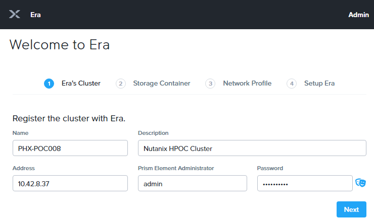

.. note::

  Era requires a Prism Element account with full administrator access. For ESXi clusters, vCenter must also be registered with Prism Element.

点击 **Next**.

选择 **Default** storage container 并点击 **Next**.

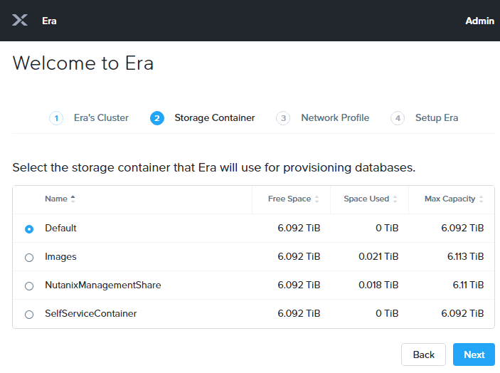

选择 Primary VLAN. 这是Era在部署新数据库时将使用的默认网络配置文件。**不要** 选择 **Manage IP Address Pool** , 因为您的AHV集群已经为该网络配置了DHCP。

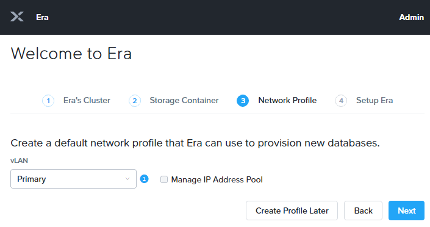

点击 **Next**.

当Era 部署成功后，点击**Get Started**.

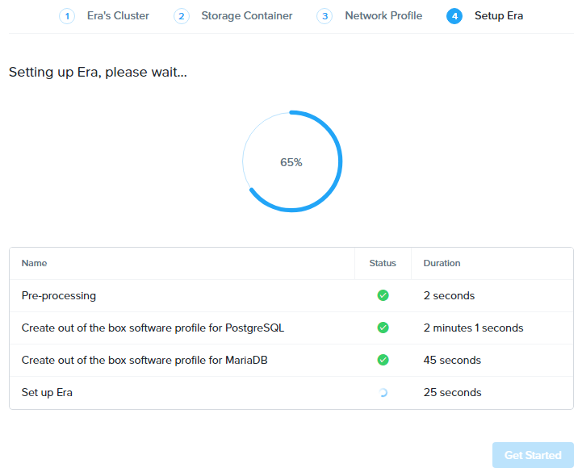

制备数据库
+++++++++++++++++++++++

Era的最初版本支持以下操作系统和数据库服务器::

- CentOS 6.9, 7.2, and 7.3
- Oracle Linux 7.3
- RHEL 6.9, 7.2, and 7.3
- Windows Server 2012, Windows Server 2012 R2, and Windows Server 2016
- Oracle 11.2.0.4.x, 12.1.0.2.x, and 12.2.0.1.x
- PostgreSQL 9.x and 10.x
- SQL Server 2008 R2, SQL Server 2012, SQL Server 2014, and SQL Server 2016

Era可用于在已注册的Nutanix集群上提供数据库服务器和数据库，也可以注册在该集群上运行的现有源数据库。在这个实验室中，将自动部署一个新的PostgreSQL数据库服务器和数据库。
通过提供软件、计算和数据库参数的示例配置文件，Era使提供简单的PostgreSQL数据库部署方式。您将研究每个配置文件，以了解它们是如何配置的。

选择 **Era > Getting Started** 并点击 **Profiles**.

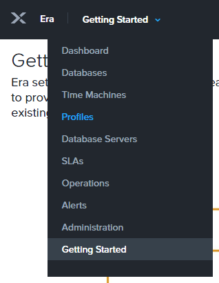

选择 **Software** 并注意到在Era配置文件中已经包含了 **PostgreSQL 10.4** 和 **MariaDB 10.3**。 在PostgreSQL以外, MariaDB, SQL Server, 和Oracle profiles 可以通过注册原有数据库到Era的方式进行创建。

选择 **Compute > DEFAULT_OOB_COMPUTE** 并注意到默认的 Compute Profile 可为VM创建4 个core, 32GiB 内存，用于支撑数据库。为了减少共享实验室环境中的内存消耗，您也可以创建一个自定义的计算配置文件，例如下面步骤。

点击 **+ Create** 并输入以下参数:

- **Name** - Lab（可自行命名）
- **Description** - Lab Compute Profile （可自行定义描述内容）
- **vCPUs** - 1 （可定义vCPU数量，比如这里是1）
- **Cores per CPU** - 2 （虚拟CPU的核数）
- **Memory (GiB)** - 16 （内存）

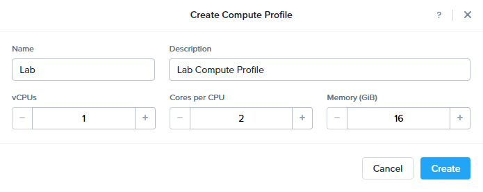

点击 **Create**.

选择 ** Database Parameters > DEFAULT_POSTGRES_PARAMS **可看到由Era提供的PostgreSQL数据库的默认参数（保留原参数，无需修改）。

选择 **Era > Profiles** 并点击 **Getting Started**.

在 **Getting Started** 页面, 点击 **Provision a Database** 下面的 **PostgreSQL**。

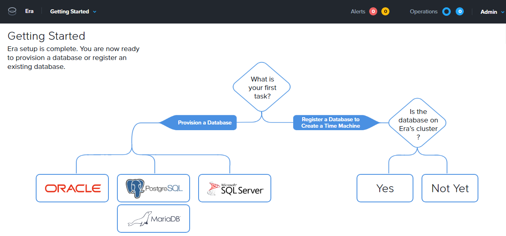

点击 **Provision a Database** .

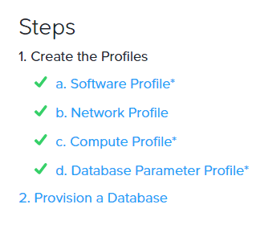

选择 **PostgreSQL** engine并点击 **Next**.

输入以下 **Database Server** 参数:

- **Database Server** - 选择 **Create New Server**
- **Database Server Name** - *Initials*-DBServer
- **Compute Profile** - Lab（默认的或刚才自定义创建的Compute profile）
- **Network Profile** - DEFAULT_OOB_NETWORK
- **Software Profile** - POSTGRES_10.4_OOB
- **Description** - (Optional) Description
- **SSH Public Key for Node Access** - （可使用以下秘钥）

.. code-block:: text

  ssh-rsa AAAAB3NzaC1yc2EAAAADAQABAAABAQCoQRdEfm8ZJNGlYLQ2iw08eVk/Wyj0zl3M5KyqKmBTpUaS1uxj0K05HMHaUNP+AeJ63Qa2hI1RJHBJOnV7Dx28/yN7ymQpvO1jWejv/AT/yasC9ayiIT1rCrpHvEDXH9ee0NZ3Dtv91R+8kDEQaUfJLYa5X97+jPMVFC7fWK5PqZRzx+N0bh1izSf8PW0snk3t13DYovHFtlTpzVaYRec/XfgHF9j0032vQDK3svfQqCVzT02NXeEyksLbRfGJwl3UsA1ujQdPgalil0RyyWzCMIabVofz+Czq4zFDFjX+ZPQKZr94/h/6RMBRyWFY5CsUVvw8f+Rq6kW+VTYMvvkv

.. 注意::

  以上SSH公钥作为示例提供，并被配置为Era提供的操作系统的授权密钥。在非实验室设置中，您将创建自己的SSH私有/公共密钥对，并在此步骤中提供公共密钥。

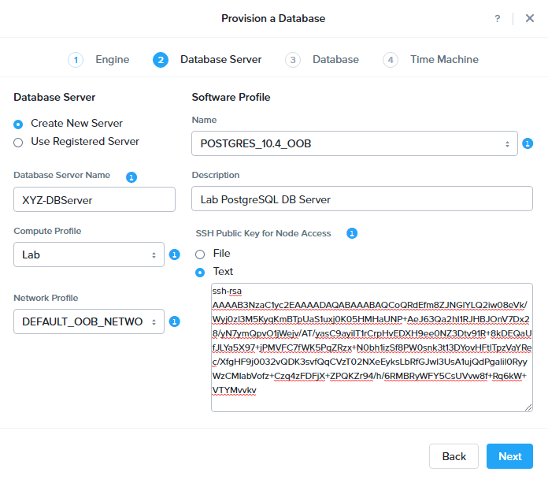

点击 **Next**.

输入以下 **Database** 字段:

- **Database Name** - *Initials*\_LabDB
- **Description** - (Optional) Description
- **POSTGRES Password** - techX2019!
- **Database Parameter Profile** - DEFAULT_POSTGRES_PARAMS
- **Listener Port** - 5432
- **Size (GiB)** - 200

.. note::

  Era还提供了在数据库创建之前和之后运行脚本或命令的能力。这些可用于根据特定的企业需求进一步定制环境。

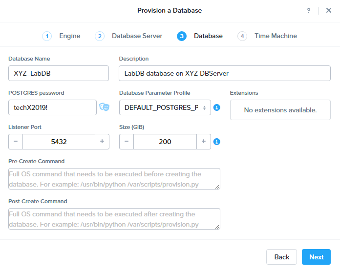

点击 **Next**.

输入以下 **Time Machine** 字段:

- **Name** - *Initials*\_LabDB_TM
- **Description** - (Optional) Description
- **SLA** - Gold
- **Schedule** - Default

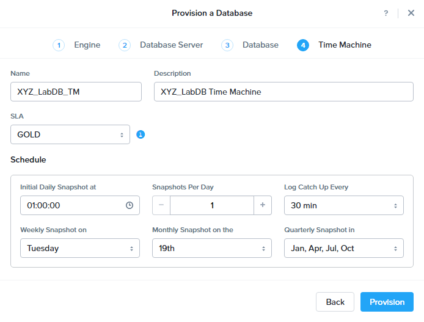

点击 **Provision**.

点击 **Operations** 在右上角查看配置进度。准备大约需要5分钟。

.. note::

 Era中的所有操作都有唯一的id，对于日志记录/审计都是完全可见的。

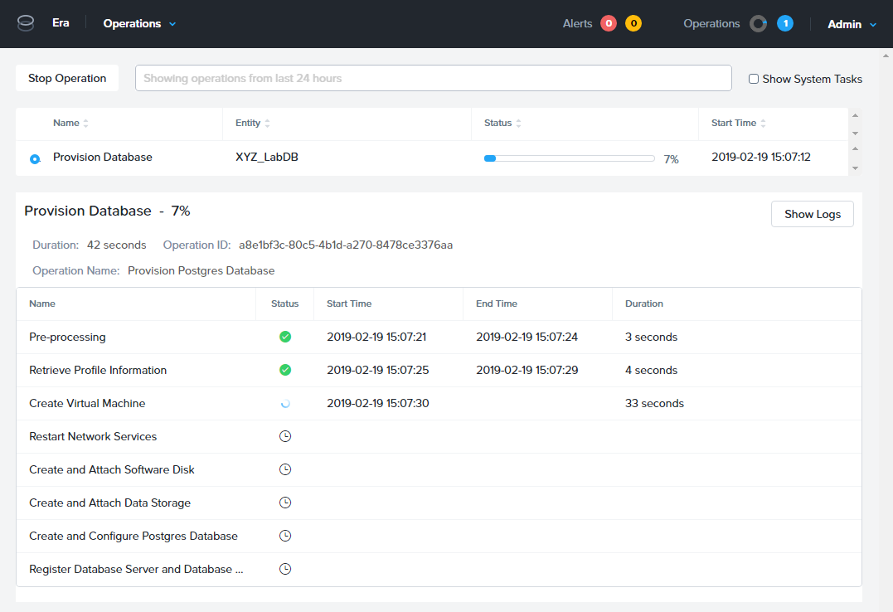

完成后, 选择 **Dashboard** 菜单并注意到在 **Source Database** 中已经有了一个新的数据库。

.. figure:: images/4i2.png

您还应该能够在prism中看到所运行的 *Initials*-**DBServer**。

连接并管理Database
++++++++++++++++++++++++++

现在Era已经成功地提供了一个数据库实例，您可连接到该实例并验证是否创建了数据库。

从下拉菜单选择 **Era > Databases**。

在 **Sources** 中，点击您所部署的数据库.

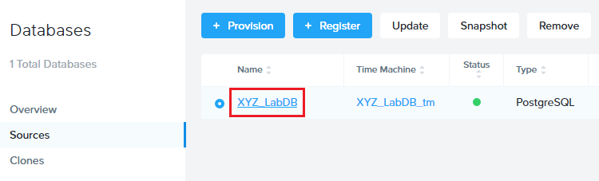

注意查看您创建的 **Database Server** 的IP地址。

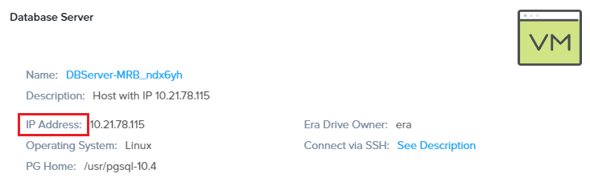

在Prism Central里，使用 *Initials*\ **-Windows-ToolsVM**, 打开tool文件夹里的 **pgAdmin**.

.. note::

  如果已安装，您也可以用本地的 pgAdmin. Tools VM 是为了一致的用户体验。

在 **Browser** 下面, 右击 **Servers** 并选择 **Create > Server...** 。

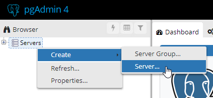

在 **General** 选项, 提供您数据库服务器名称 (e.g. *Initials*-**DBServer**).

在 **Connection** 选项, 输入以下信息:

- **Hostname/IP Address** - *Initials*-DBServer IP Address
- **Port** - 5432
- **Maintenance Database** - postgres
- **Username** - postgres
- **Password** - techX2019!

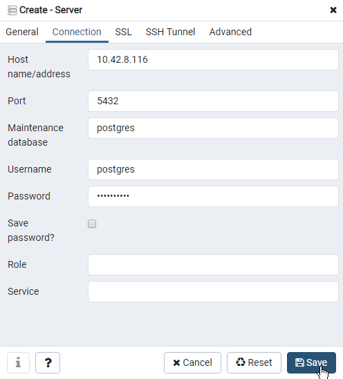

展开 *Initials*\ **-DBServer > Databases** 并注意到Era已经部署了一个空的数据库。

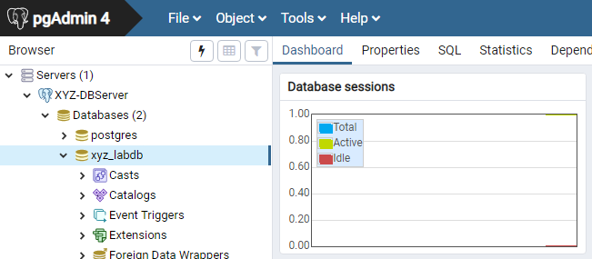

..  Now you will create a table to store data regarding Names and Ages.

  Expand *Initials*\_**labdb** **> Schemas > public**. Right-click on **Tables** and select **Create > Table**.

  .. figure:: images/5e.png

  On the **General** tab, enter **table1** as the **Name**.

  On the **Columns** tab, click **+** and fill out the following fields:

  - **Name** - Id
  - **Data type** - integer
  - **Primary key?** - Yes

  Click **+** and fill out the following fields:

  - **Name** - Name
  - **Data type** - text
  - **Primary key?** - No

  Click **+** and fill out the following fields:

  - **Name** - Age
  - **Data type** - integer
  - **Primary key?** - No

  .. figure:: images/5f.png

  Click **Save**.

  Using your **Tools VM**, open the following link to download a .CSV file containing data for your database table: http://ntnx.tips/EraTableData

  Using **pgAdmin**, right-click **table1** and select **Import/Export**.

  Toggle the **Import/Export** button to **Import** and fill out the following fields:

  - **Filename** - C:\\Users\\Nutanix\\Downloads\\table1data.csv
  - **Format** - csv

  .. figure:: images/5g.png

  Click **OK**.

  You can view the imported data by right-clicking **table1** and selecting **View/Edit Data > All Rows**.

克隆您的 PostgreSQL 资源
+++++++++++++++++++++++

现在您已经创建了一个源数据库，您可以使用Era Time Machine轻松地克隆它。数据库克隆有助于开发和测试目的，允许非生产环境在不影响生产操作的情况下利用生产数据。Era克隆利用了nutanix本地写时复制克隆技术，允许零字节的数据库克隆。这种空间效率可以显著降低支持大量数据库克隆的环境的存储成本。

在 **Era > Time Machines** , 为你的数据库实例选择 Time Machine instance，如以下图中的XYZ_LabDB_tm。

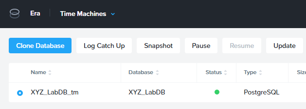

点击 **Snapshot** 并输入 **First** 作为 **Snapshot Name**.

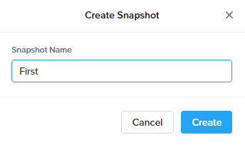

点击 **Create**.

你可以在 **Era > Operations** 监控 **Create Snapshot** 执行作业 .

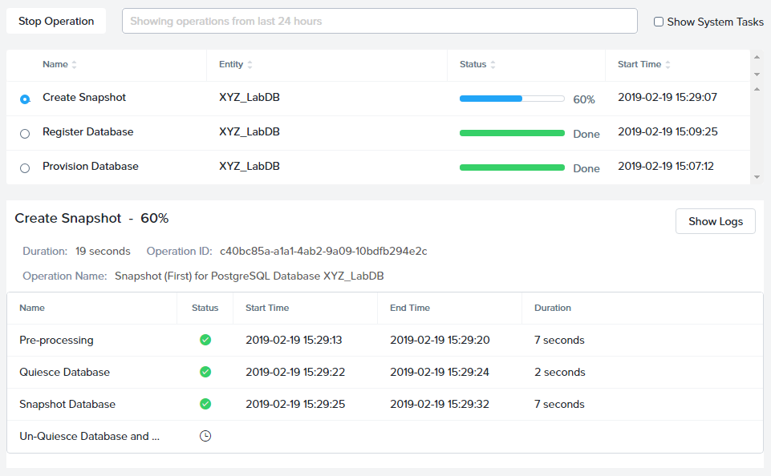

在快照作业创建完后, 在 **Era > Time Machines** 选择Time Machine instance 并点击 **Clone Database**.

在 **Time** 选择 **Snapshot > First**.

.. note::

  无需创建手动快照，Era还提供了基于时间增量点(包括连续的(每秒钟)、每日、每周、每月或每季)克隆数据库的能力。可用性由源的SLA控制。

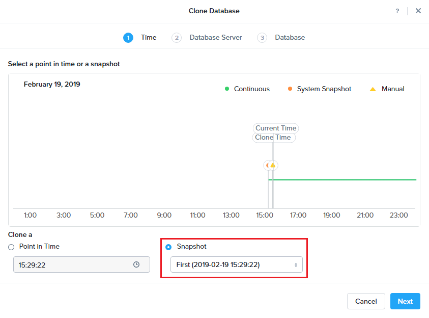

点击 **Next**.

在 **Database Server** 输入以下信息：

- **Database Server** - Create New Server
- **VM Name** - *Initials*-DBServer-Clone
- **Compute Profile** - Lab
- **Network Profile** - DEFAULT_OOB_NETWORK
- **SSH Public Key** -

.. code-block:: text

  ssh-rsa AAAAB3NzaC1yc2EAAAADAQABAAABAQCoQRdEfm8ZJNGlYLQ2iw08eVk/Wyj0zl3M5KyqKmBTpUaS1uxj0K05HMHaUNP+AeJ63Qa2hI1RJHBJOnV7Dx28/yN7ymQpvO1jWejv/AT/yasC9ayiIT1rCrpHvEDXH9ee0NZ3Dtv91R+8kDEQaUfJLYa5X97+jPMVFC7fWK5PqZRzx+N0bh1izSf8PW0snk3t13DYovHFtlTpzVaYRec/XfgHF9j0032vQDK3svfQqCVzT02NXeEyksLbRfGJwl3UsA1ujQdPgalil0RyyWzCMIabVofz+Czq4zFDFjX+ZPQKZr94/h/6RMBRyWFY5CsUVvw8f+Rq6kW+VTYMvvkv

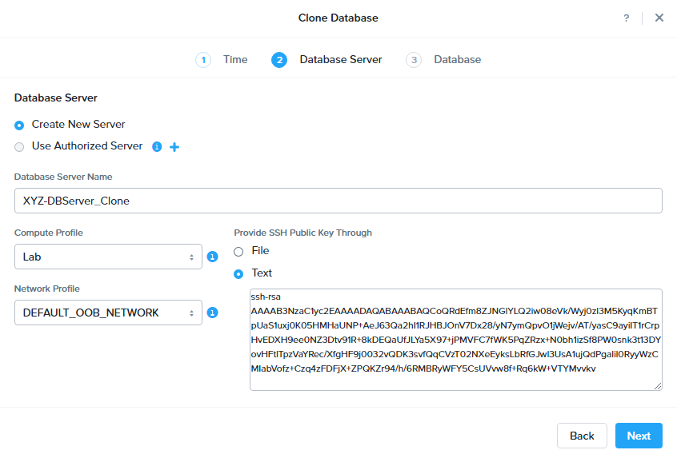

点击 **Next**.

在 **Database Server** 页面，输入以下信息:

- **Name** - *Initials*\_LabDB_Clone
- **Description** - (Optional) Description
- **Password** - techX2019!
- **Database Parameter Profile** - DEFAULT_POSTGRES_PARAMS

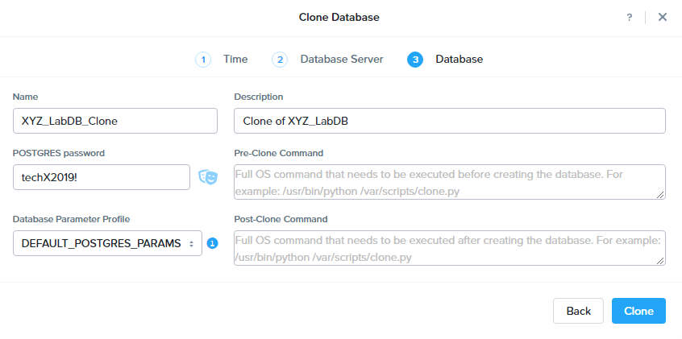

点击 **Clone**.

克隆过程将花费与提供原始数据库大致相同的时间，并且可以在 **Era > Operations** 中进行监视。在等待克隆完成的同时，探索 **Era > SLAs**，以了解Era提供的标准SLA之间的差异，或者创建您自己的定制SLA。

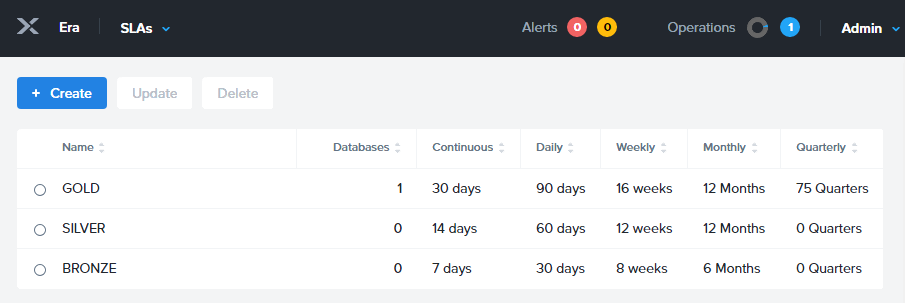

在完成克隆操作之后，您可以按照前一节中描述的那样连接到克隆实例，并连接到数据库。
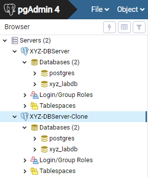

新创建的克隆数据库现在可以使用了。

刷新克隆数据库
++++++++++++++++++++++++++++

使用源数据库中的新数据轻松刷新克隆数据库的能力通过确保它们能够访问新的相关数据，从而改进了开发、测试和其他用例。在本节中，您将添加一个用于将数据存储到源数据库的新表，并刷新同步到现有的克隆。

在 **pgAdmin**, 选择源数据库(非cloned 的数据库), 在菜单栏中选择 **Tools > Query Tool**.

启动 pgAdmin, 选择您的数据库实例, 到 **Tools** 菜单并选择 **Query Tool**.

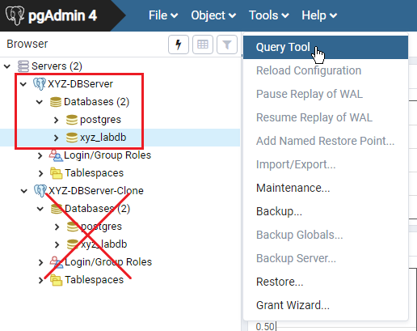

在 **Query Tool**, 输入以下 SQL 命令到edito编辑器中：

.. code-block:: postgresql
  :name: products-table-sql

  CREATE TABLE products (
  product_no integer,
  name text,
  price numeric
  );

点击 :fa:`bolt` **Execute/Refresh**.

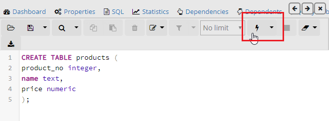

确认在源数据库中已经创建了“products”这个新表， **Schemas > Public > Tables > products**.

.. note::

  您可能需要刷新 **Tables** 表才能显示新创建的表。  

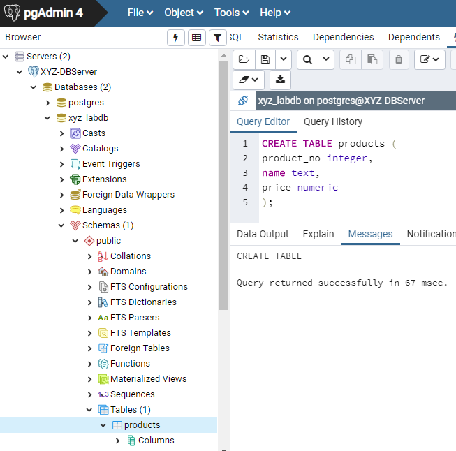

在此之前，您创建了一个手动快照作为克隆数据库的基础, 为了刷新您将利用Era的 **Point in Time** 功能。

配置源数据库时，配置的默认日志同步 **Log Catch Up** 计划是每30分钟一次。根据这个计划，您应该能够根据超过30分钟的更新来刷新数据库，而不需要进一步的操作。
在本例中，您只是在源数据库中创建了 **products** 表，因此需要手动执行日志同步操作 **Log Catch up** 来将事务日志从源数据库复制到Era。

在 **Era > Time Machines** , 选择源source数据库的Time Machine instance 并点击 **Log Catch Up > Yes**.

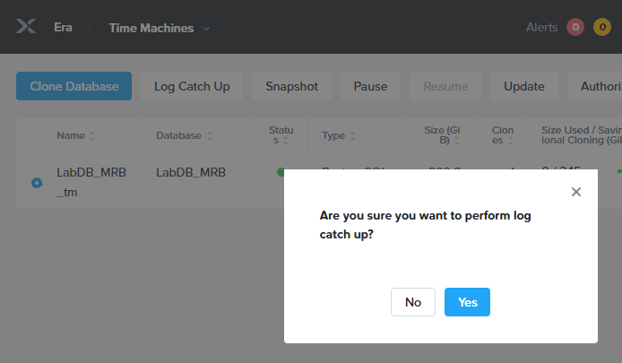

一旦 **Log Catchup** 作业执行成功, 在 **Era > Databases > Clones**, 选择您刚所克隆的数据库，并点击 **Refresh**。

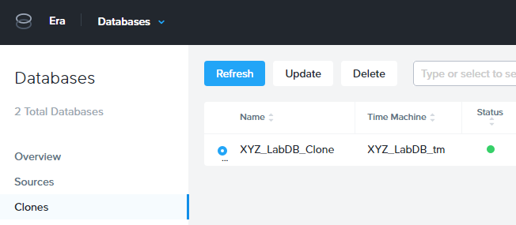

刷新至最新的可用点 **Point in Time** 点击 **Refresh**。

.. figure:: images/27d.png

请观察Era刷新克隆数据库的步骤 **Operations**。

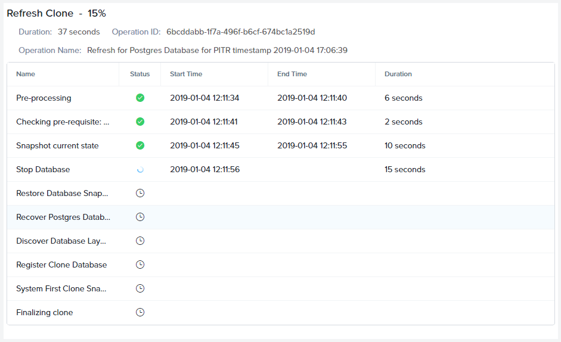

完成 **Refresh Clone** 作业后，在pgAdmin中刷新您的Clone数据库的 **Tables** 视图，并确认 **products** 表现在已经存在。

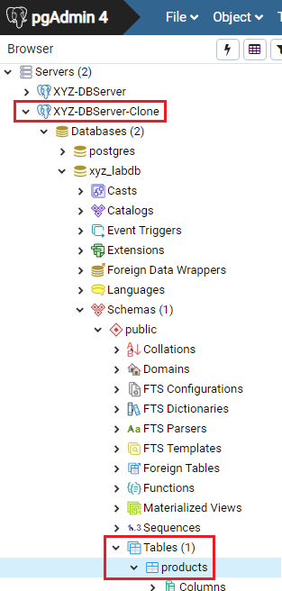

只需几次点击和几分钟，您就可以使用最新可用的生产数据更新克隆的数据库。通过提供基于先前快照或时间点的克隆，可以利用相同的方法从数据库中恢复缺少的数据。

返回仪表板 **Dashboard** 并查看Era提供给管理员的关键信息，包括存储节省、克隆时间、任务和警报。

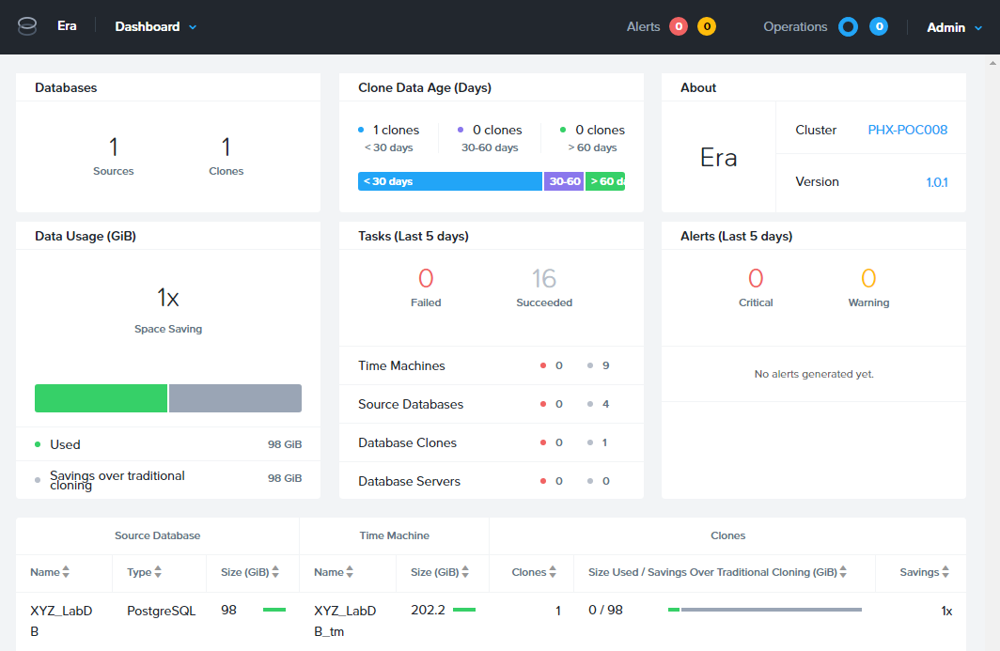

概要
+++++++++

关于Nutanix Era的核心内容：

- Era支持Oracle、SQL Server、PostgreSQL、MariaDB。

- Era支持一键式操作，用于注册、配置、克隆和刷新受支持的数据库。

- Era支持与公共云相同的简单性和操作效率，同时允许dba维护控制。

- Era自动化了复杂的数据库操作——使用传统技术大大减少了DBA的时间和管理数据库的成本，大大节省了企业运营成本。

- Era允许数据库管理员跨数据库引擎标准化数据库部署，并自动合并数据库最佳实践。

- Era允许dba将其环境克隆到最新的应用程序一致性事务。

- Era提供了一个REST API，支持与其他编制和自动化工具的集成。

