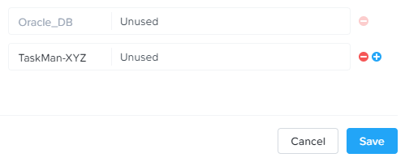
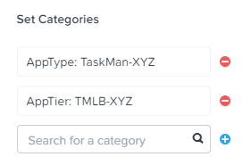
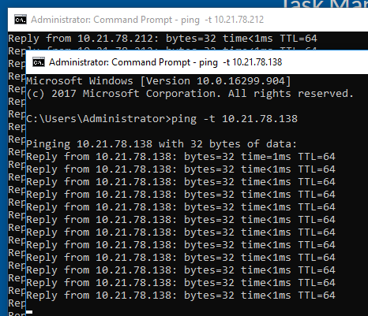

.. _flow_secure_app:

----------------
Flow: Secure App
----------------

Overview
++++++++

.. note::

  Estimated time to complete: 15-30 MINUTES

In this exercise you will create a security policy to restrict communication between the application VMs.

Securing An Application
+++++++++++++++++++++++

Now that you have deployed your Task Manager application, lets secure the communications between the different servers.

Defining Category Values
........................

Flow provides multiple out of the box categories for... <?>

In **Prism Central**, select :fa:`bars` **> Virtual Infrastructure > Categories**.

Select the checkbox for **AppType** and click **Actions > Update**.

.. figure:: images/12.png

Click the :fa:`plus-circle` icon beside the last value to add an additional Category value.

Specify **TaskMan-**\ *Initials* as the value name.

Click **Save**.

Select the checkbox for **AppTier** and click **Actions > Update**.

Click the :fa:`plus-circle` icon beside the last value to add an additional Category value.

Specify **TMWeb-**\ *Initials* as the value name. This category will be applied to the application's web tier.

Click :fa:`plus-circle` and specify **TMDB-**\ *Initials*. This category will be applied to the application's MySQL database.

Click :fa:`plus-circle` and specify **TMLB-**\ *Initials*. This category will be applied to the application's HAProxy load balancer.

.. figure:: images/14.png

Click **Save**.

Creating a Security Policy
..........................

While you wait for <blah blah blah>.

In **Prism Central**, select :fa:`bars` **> Virtual Infrastructure > Policies > Security Policies**.

Click **Create Security Policy > Secure an Application**.

Fill out the following fields:

- **Name** - AppTaskMan-\ *Initials*
- **Purpose** - Restrict unnecessary access to Task Manager
- **Secure this app** - AppType: TaskMan-\ *Initials*
- Do **NOT** select **Filter the app type by category**.

.. figure:: images/18.png

Click **Next**.

If prompted, click **OK, Got it!** on the tutorial diagram of the **Create App Security Policy** wizard.

To allow for more granular configuration of the security policy, click **Set rules on App Tiers** rather than applying the same rules to all components of the application.

.. figure:: images/19.png

Click **+ Add Tier**.

Select **AppTier: TMLB-**\ *Initials* from the drop down.

Repeat for **AppTier: TMWeb-**\ *Initials* and **AppTier: TMDB-**\ *Initials*.

.. figure:: images/20.png

Next you will define the **Inbound** rules, which control which sources you will allow to communicate with your application. You can allow all inbound traffic, or define whitelisted sources. By default, the security policy is set to deny all incoming traffic.

In this scenario we want to allow inbound TCP traffic on port 80 from all clients on the production network.

Under **Inbound**, click **+ Add Source**.

Specify the **Environment:Production** and click **Add**.

.. note::

  Sources can also be specified by IP or subnet, but Categories allow for greater flexibility as this data can follow a VM regardless of changes to its network location.

To create an inbound rule, select the **+** icon that appears to the left of **AppTier: TMLB-**\ *Initials*.

.. figure:: images/21.png

Fill out the following fields:

- **Protocol** - TCP
- **Ports** - 80

.. figure:: images/22.png

.. note::

  Multiple protocols and ports can be added to a single rule.

Click **Save**.

Calm could also require access to the VMs for workflows including scaling out, scaling in, or upgrades. Calm communicates with these VMs via SSH, using TCP port 22.

Under **Inbound**, click **+ Add Source**.

Fill out the following fields:

- **Add source by:** - Select **Subnet/IP**
- Specify *Your Prism Central IP*\ /32

.. note::

  The **/32** denotes a single IP as opposed to a subnet range.

  This step also could have been achieved by assigning a relevant category to your Prism Central VM. This would also simplify the policy if dealing with multiple Prism Central VMs as you would have 1 rule applied to multiple IPs.

.. figure:: images/23.png

Click **Add**.

Select the **+** icon that appears to the left of **AppTier: TMLB-**\ *Initials*, specify **TCP** port **22** and click **Save**.

Repeat for **AppTier: TMWeb-**\ *Initials* and **AppTier: TMDB-**\ *Initials* to allow Calm to communicate with the web tier and database VMs.

.. figure:: images/24.png

By default, the security policy allows the application to send all outbound traffic to any destination. The only outbound communication required for your application is for the database VM to be able to communicate with your DNS server.

Under **Outbound**, select **Whitelist Only** from the drop down menu, and click **+ Add Destination**.

Fill out the following fields:

- **Add source by:** - Select **Subnet/IP**
- Specify *Your Domain Controller IP*\ /32

.. figure:: images/25.png

Click **Add**.

Select the **+** icon that appears to the right of **AppTier: TMDB-**\ *Initials*, specify **UDP** port **53** and click **Save** to allow DNS traffic.

.. figure:: images/26.png

Each tier of the application communicates with other tiers and the policy must allow this traffic. Some tiers such as the load balancer and web do not require communication within the same tier.

To define intra-app communication, click **Set Rules within App**.

.. figure:: images/27.png

Click **AppTier: TMLB-**\ *Initials* and select **No** to prevent communication between VMs in this tier. There is only a single load balancer VM within the tier.

While **AppTier: TMLB-**\ *Initials* is still selected, click the :fa:`plus-circle` icon to the right of **AppTier: TMWeb-**\ *Initials* to create a tier to tier rule.

Fill out the following fields to allow communication on TCP port 80 between the load balancer and web tiers:

- **Protocol** - TCP
- **Ports** - 80

.. figure:: images/28.png

Click **Save**.

Click **AppTier: TMWeb-**\ *Initials* and select **No** to prevent communication between VMs in this tier. While there are multiple web server VMs, they do not need to communicate with each other.

While **AppTier: TMWeb-**\ *Initials* is still selected, click the :fa:`plus-circle` icon to the right of **AppTier: TMDB-**\ *Initials* to create another tier to tier rule.

Fill out the following fields to allow communication on TCP port 3306 to allow the database connection between the web servers and the MySQL database:

- **Protocol** - TCP
- **Ports** - 3306

.. figure:: images/29.png

Click **Save**.

Click **Next** to review the security policy.

Click **Save and Monitor** to save the policy.

Assigning Category Values
.........................

.. note::

  By this time, your application blueprint should have finished provisioning. If it has not completed, please wait until it has finished to proceed.

You will now apply the previously created categories to the VMs provisioned from your Task Manager blueprint. Flow categories can be assigned as part of a Calm blueprint, but the purpose of this exercise is to understand category assignment to existing virtual machines in an environment.

In **Prism Central**, select :fa:`bars` **> Virtual Infrastructure > VMs**.

Click **Filters** and search for *Initials-* to display your virtual machines.

.. figure:: images/15.png

Using the checkboxes, select the 4 VMs associated with the application (HAProxy, MYSQL, WebServer-0, WebServer-1) and select **Actions > Manage Categories**.

.. figure:: images/16.png

.. note::

  You can also use the **Label** functionality to make searching for this group of VMs faster in the future.

  .. figure:: images/16b.png

Specify **AppType:TaskMan-**\ *Initials* in the search bar and click **Save** icon to bulk assign the category to all 4 VMs.

Select ONLY the *Initials*\ **-HAProxy** VM, select **Actions > Manage Categories**, specify the **AppTier:TMLB-**\ *Initials* category and click **Save**.

Repeat this procedure to assign **AppTier:TMWeb-**\ *Initials* to your web tier VMs.

Repeat this procedure to assign **AppTier:TMDB-**\ *Initials* to your MySQL VM.

Finally, repeat this procedure to assign **Environment:Dev** to your Windows client VM.

Monitoring and Applying a Security Policy
+++++++++++++++++++++++++++++++++++++++++

Before applying the Flow policy, you will ensure the Task Manager application is working as expected.

Testing the Application
.......................

From **Prism Central > Virtual Infrastructure > VMs**, note the IP address of your *Initials*\ **-HAPROXY-0...** and *Initials*\ **-MYSQL-0...** VMs.

Launch the console for your *Initials*\ **-WinClient-0** VM.

From the *Initials*\ **-WinClient-0** console open a browser and access \http://*HAPROXY-VM-IP*/.

Verify that the application loads and that tasks can be added and deleted.

.. figure:: images/30.png

Open **Command Prompt** and run ``ping -t MYSQL-VM-IP`` to verify connectivity between the client and database. Leave the ping running.

Open a second **Command Prompt** and run ``ping -t HAPROXY-VM-IP`` to verify connectivity between the client and load balancer. Leave the ping running.

Using Flow Visualization
........................

Return to **Prism Central** and select :fa:`bars` **> Virtual Infrastructure > Policies > Security Policies > AppTaskMan-**\ *Initials*.

Verify that **Environment: Dev** appears as an inbound source. The source and line appear in yellow to indicate that traffic has been detected from your client VM.

.. figure:: images/32.png

Mouse over the line connecting **Environment: Dev** to **AppTier: TMLB-**\ *Initials* to view the protocol and connection information.

Click the yellow flow line to view a graph of connection attempts over the past 24 hours.

.. figure:: images/33.png

Are there any other detected outbound traffic flows? Hover over these connections and determine what ports are in use.

Click **Update** to edit the policy.

Click **Next** and wait for the detected traffic flows to populate.

Mouse over the **Environment: Dev** source that connects to **AppTier: TMLB-**\ *Initials* and click the :fa:`check` icon that appears.

.. figure:: images/35.png

Click **OK** to complete adding the rule. The **Environment: Dev** source should now turn blue, indicating that it is part of the policy. Mouse over the flow line and verify that both ICMP (ping traffic) and TCP port 80 appear.

Click **Next > Save and Monitor** to update the policy.

Applying Flow Policies
......................

In order to enforce the policy you have defined, the policy must be applied.

Select **AppTaskMan-**\ *Initials* and click **Actions > Apply**.

.. figure:: images/36.png

Type **APPLY** in the confirmation dialogue and click **OK** to begin blocking traffic.

Return to the *Initials*\ **-WinClient-0** console.

What happens to the continuous ping traffic from the Windows client to the database server? Is this traffic blocked?

Verify that the Windows Client VM can still access the Task Manager application using the web browser and the load balancer IP address. Can you still enter new tasks that require communication between the web server and database?

Takeaways
+++++++++

- Microsegmentation offers additional protection against malicious threats that originate from within the data center and spread laterally, from one machine to another.
- Categories created in Prism Central are available inside Calm blueprints.
- Security policies leverage the text based categories in Prism Central.
- Flow can restrict traffic on certain ports and protocols for VMs running on AHV.
- The policy is created in **Save and Monitor** mode, meaning traffic is not actually blocked until the policy is applied. This is helpful to learn the connections and ensure no traffic is blocked unintentionally.
