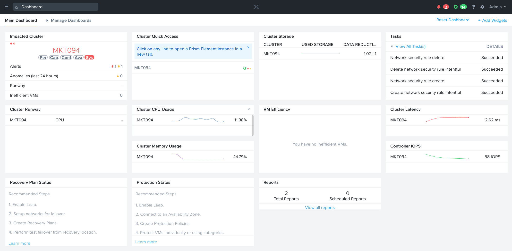
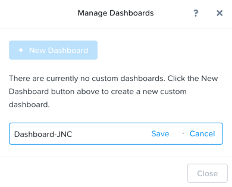
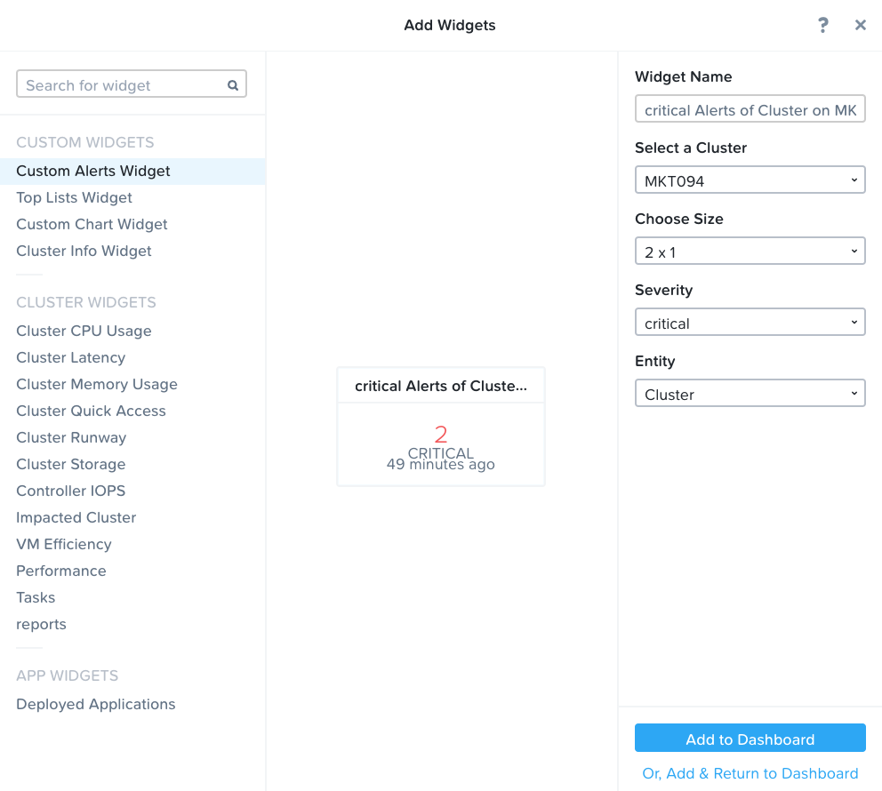
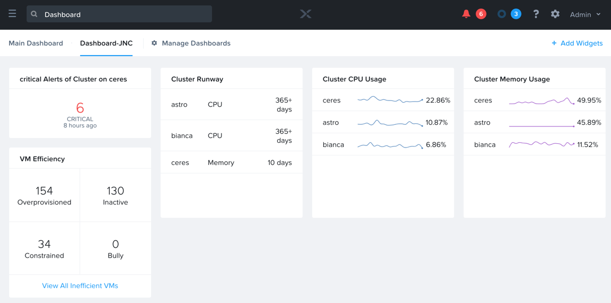
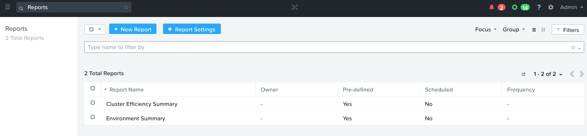
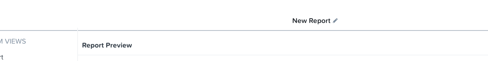
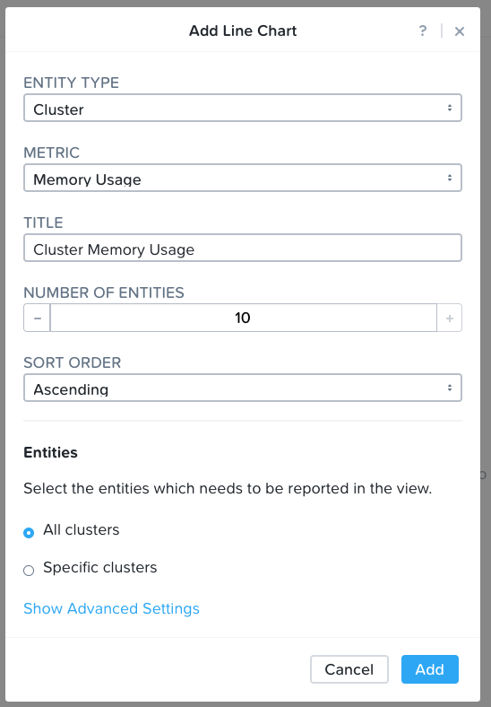
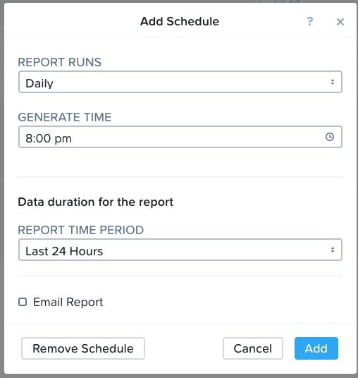
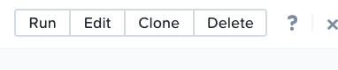

.. _prism_central_dashboards_reports:

-------------------------------------
Prism Central: Dashboards and Reports
-------------------------------------

Overview
++++++++

This lab will introduce Prism Central’s Dashboards and Reporting features.

Prism Central Dashboards
++++++++++++++++++++++++

Prism Central dashboards allow you to quickly view the current state of the systems registered under that Prism Central instance.

The kind of information that you can obtain from a dashboard depends upon your interests.

It can include alerts about anything related to the health of a cluster, all the way to performance information.

Create a Custom Dashboard
.........................

Dashboards can also be customized.

#. #. In **Prism Central > :fa:`fa-navicon` > Dashboard**, or click the **Home X**

The main dashboard is the first dashboard presented when the system first installed.

#. This dashboard can be customized as well, but instead we will each create new dashboard.

#. Click on **:fa: `fa-gear` Manage Dashboards** to open the Manage Dashboards window.

#. Once there click on **+ New Dashboard**

#. Enter "Dashboard-*intials*" for the name and click **Save**.

#. Now let’s add some Widgets.

.. note::

  Widgets refer to the different sections of a dashboard.
  A widget can be a graph, an alert board, or simply an information table showing nuggets of information.
  You can choose to have widgets informing you on whatever piece of information you are interested, simply choose from the available entities.

#. Click **Add Widgets**.

#. From the list of available Widgets on the left hand side, notice there are three types of Widgets:

- CUSTOM WIDGETS
- CLUSTER WIDGETS
- APP WIDGETS

#. Choose any widget that may interest you in the **CUSTOM WIDGETS** section, and note that a custom set of parameters appears on the right hand side to specify.

#. Select amongst the options as desired and click **Add to Dashboard**.

#. Next select another widget, now from the **CLUSTER WIDGETS** list. This time click on **Or, Add & Return to Dashboard.** to return to your newly created dashboard.

.. note::

  There is a **+ Add Widgets** button in the top right corner of Prism Central that can be used to add more widgets at any time.

  Also, note that hovering over any widget on the dashboard will show a little gray X on the top right corner that can be used to delete the widget.

Prism Central Reports
+++++++++++++++++++++

Prism Central allows you to generate historical reports about your cluster environment that can be used to aid administrators in monitoring the health and performance of the clusters they manage.

Such reports can include resource consumption, abnormal behavior, and other valuable operational insights.

These reports can be manually generated or they can be automated from Prism Central to be sent out via email when it’s most convenient.

#. In **Prism Central > :fa:`fa-navicon` > Operations > Reports**.

#. There you will see the two pre-defined reports available for you to use immediately:

- Cluster Efficiency Summary
- Environment Summary

#. Lets run the **Cluster Efficiency Summary** report.

#. Select **Cluster Efficiency Summary**, then click **Run** from the **Actions** drop-down menu.

.. figure:: images/monitoring_01.png

#. Next, fill out the following fields and click **Run** from the **Actions** dropdown:

- **Report instance Name** - *initials* - Cluster Efficiency 
- **Time Period for Report** - Last 24 Hours

#. Click **Run**.

#. Now lets run the **Environment Summary** report.

#. Select **Environment Summary**, then click **Run** from the **Actions** drop-down menu.

#. Next, fill out the following fields and click **Run**:

- **Report instance Name** - *initials* - Environment Summary
- **Time Period for Report** - Last 24 Hours

#. Click **Run**.

#. Once the reports are complete, select each report, and do the following:

#. Click **View Instances.** from the **Actions** drop-down menu.

- To view the report in a separate tab, click the name of the report.
- To download the report, select its check box, then click **Download** at the upper right of the screen.

#. Review the contents of the reports you created in this exercise.

Create a Custom Report
......................

#. To create a new custom report, click **+ New Report**.

#. Change the name of the report from **New Report** to *initials*-**Report**

#. From the **CUSTOM VIEWS** menu on the left, click **Line Chart** and fill in the following:

- **Entity Type** - Cluster
- **Metric** - Memory Usage
- **Tittle** - *initials* - Cluster Memory Usage
- **Number of Entities** – 10
- **Sort Order** - Ascending

#. Click **Add**

#. From the **PRE-DEFINED VIEWS**, click on any entities that look interesting to you.

.. note::

  Since these are pre-defined, there are no extra configuration steps needed and they get added to the report immediately.

#. Click on the **Add Schedule** button in the top right corner to add an automatic schedule to process the reports.

#. Select any desired frequency, time, and duration to run the report.

.. note::

  If SMTP is configured appropriately in Prism Central, this automated report can also get sent to any valid email address entered.

#. Click **Save** when done customizing your report.

#. Now your report has been saved, but note that there are no instances of it. This is because we have not run the report yet.

#. To run the report, click on **Run** from the top right corner.

.. note::

  Cloning a report is useful to leverage an existing report and edit it to customize it further.

#. When the report finishes, you will see the first instance of this reported available for viewing by clicking **PDF** under Download.

#. Then click on the X on the top right corner to exit.

#. If you leave the report as is, it will get automatically run and sent to a provided email address at the specific frequency and time set.

#. The reports themselves can also be customized under **Report Settings** if different colors or logos are desired.

Takeaways
+++++++++

- The Prism Central Customizable Dashboards allow you to setup user and team specific dashboards with the information they care about.
- The Prism Central report management feature provides you with an ability to configure and deliver the historical reports containing information about the infrastructure resources straight into your mailbox according to the schedules configured.
