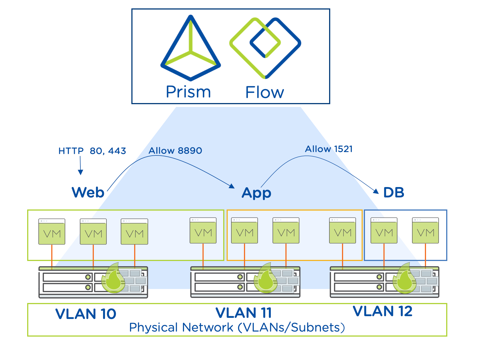
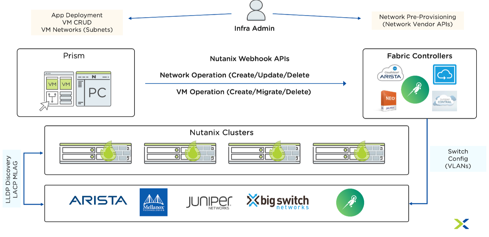

.. _what_is_flow:

------------
什么是Flow
------------

概述
++++++++

Flow通过对AHV上的虚拟机使用微分段提供安全性，将集中管理（Prism Central）与分布式实施（每个节点）、使用类别（逻辑分组）实现以应用程序为中心的策略管理、丰富的可视化和自动化（API）相结合。

今天是什么情况呢？
+++++++++++++++++++++++++++++++++

为什么要做微分段？
......................

.. figure:: images/what_is_flow_01.png

通过Flow+微分段保护HCI
..........................................

.. figure:: images/what_is_flow_02.png

Flow: 表面之下
....................

- 对物理基础架构没有改变
- 无需安装。Flow原生于AHV和OVS。
- 虚拟机分组基于应用拓扑 (独立于物理架构，VLAN和子网）
- 根据应用层定义策略，如Web，App和数据库。
- 策略自动应用于组里所有现有和新建的虚拟机。
- 规则推送（分发）到每个节点并本地实施。
- 集中管理、运营和治理

为什么是Flow?
.........

.. figure:: images/what_is_flow_04.png

用例: App分段
..........................

.. figure:: images/what_is_flow_05.png

用例: 虚拟桌面微分段
...............................

.. figure:: images/what_is_flow_06.png

用例: 网络与安全自动化
.......................................

环境隔离策略
................

- 环境隔离 - 环境隔离策略限制两个已定义的虚拟机组相互通信

.. figure:: images/what_is_flow_08.png

应用安全策略
...........................

- 应用 - 灵活的安全策略, 为单层/多层应用定义进站流量来源和出站流量目的地。

.. figure:: images/what_is_flow_09.png

检疫隔离策略
.................

- 检疫隔离 - 程序化或手动限制网络连接

.. figure:: images/what_is_flow_10.png
