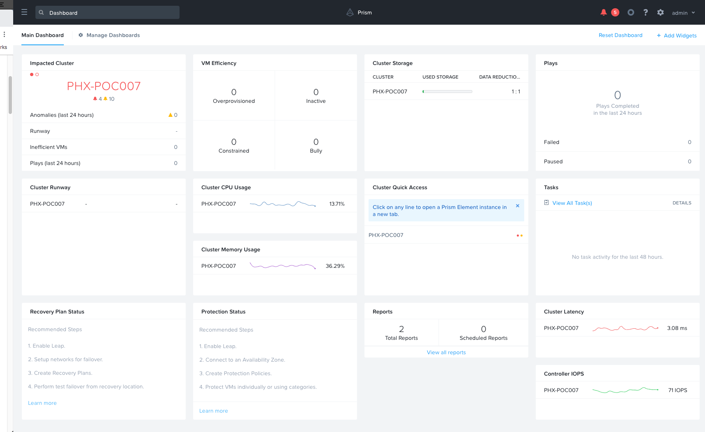
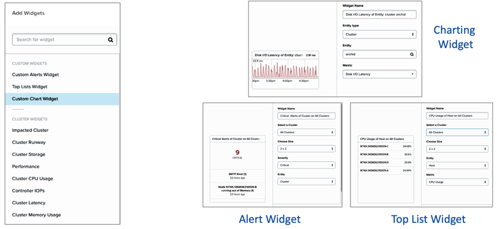
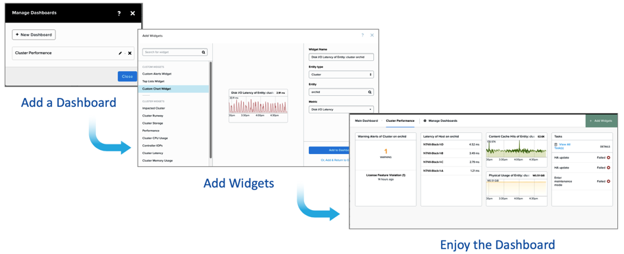
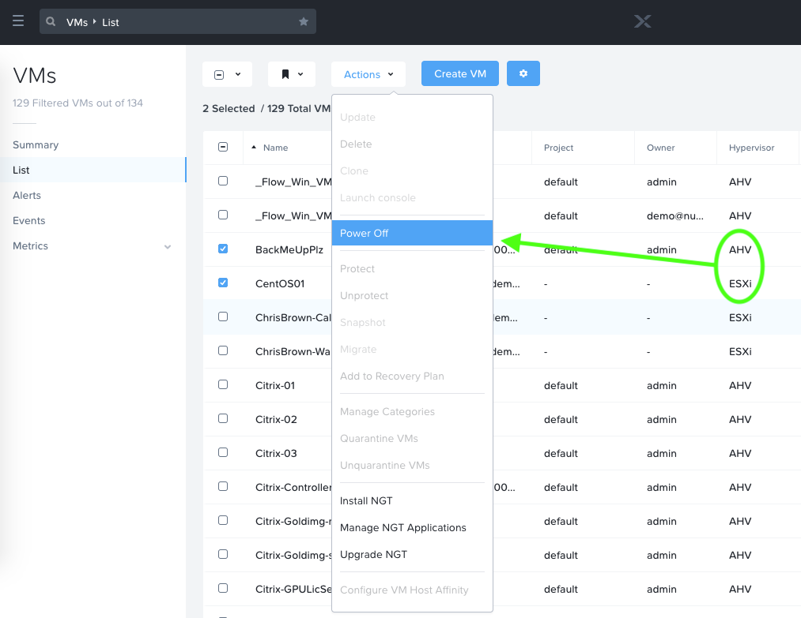
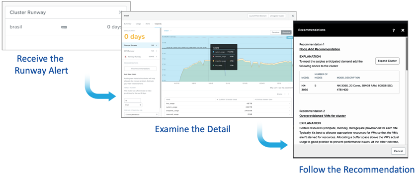
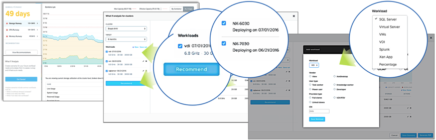

.. _what_is_prism_central:

---------------------
What Is Prism Central
---------------------

Overview
++++++++

Nutanix Prism provides central access for administrators to configure, monitor, and manage virtual environments.

Powered by advanced data analytics, heuristics, and rich automation, Prism offers unprecedented simplicity by combining several aspects of datacenter management into a single, consumer-grade solution.

Using innovative machine learning technology, Prism can mine large volumes of system data easily and quickly and generate actionable insights for optimizing all aspects of virtual infrastructure management.

Prism is a part of every Nutanix deployment and has two core components: Prism Element and Prism Central. Prism Element is a service built into the platform for every Nutanix cluster deployed. It provides the ability to fully configure, manage, and monitor Nutanix clusters running any hypervisor.

As organizations deploy multiple Nutanix clusters, they want to be able to manage all of them from a single Prism instance, so Nutanix introduced Prism Central.

This global management experience offers a single place to monitor performance, health, and inventory for all Nutanix clusters. Prism Central is available in a standard version included with every Nutanix deployment and as a Pro version that is licensed separately and enables several advanced features.

Prism Central
+++++++++++++

Prism Central Customizable Dashboards
.....................................

What is it?

- Live dashboards for at-a-glance view of the entire infrastructure
- Build/customize from pre-defined widgets
- Customize charts, alerts, performance metrics amongst others

Benefits:

- Monitor everything from storage to apps from home screen
- Reduce mean time to restore from failures
- Different views for different employees

Customize Dashboards with Widgets
.................................

Build A Performance Dashboard
.............................

Prism Self-Service
..................

What is it?

- Self-service access to IT resources
- IT sets policies and provides access to end users such as developers

Components:

- Admin Portal: Create projects, set policies, assign users
- End User Portal: Deploy and monitor applications

Benefits:

- Frictionless service delivery
- Developers empowered to get AWS like experience

.. figure:: images/what_is_prismcentral_06.png

VM Management for ESXi
......................

What is it?

- ESXi Management from Prism
- Does not displace vCenter

Use Prism for common use cases:

- VM Create
- VM Update
- VM Delete
- VM Power On/Off Ops
- Launch console
- Clone

Key Points:

- Consumer-grade virtualization management across different hypervisors
- Unified management plane for virtualization, storage and compute

Nutanix Calm
............

Part of The Nutanix Solution Stack

.. figure:: images/what_is_prismcentral_07.png

Prism Pro
+++++++++

Prism Central Report Managing and Machine Learning Capability
.............................................................

With PC Machine learning you can:

- Analyze resource usage over time.
- Monitor resource consumption.
- Identify abnormal behavior.
- Take advantage of guided resource planning.

With report management you can:

- Configure and deliver the historical reports containing information about the infrastructure resources.
- Gain operational insights of your infrastructure into your mailbox according to the schedule that you have configured.

.. figure:: images/what_is_prismcentral_08.png

Actionable Capacity Forecasting
...............................

What is it?

- Detailed capacity trends
- Intelligent recommendations
- Powered by patent pendingX-FIT algorithm

Key Points:

- Enables pay as you grow capacity expansion
- Eliminates guesswork

.. figure:: images/what_is_prismcentral_09.png

Capacity Runway
...............................

Capacity Runway = Time before workloads run out of capacity

.. figure:: images/what_is_prismcentral_15.png

Capacity Optimization Recommendation
....................................

Just-In-Time Forecast
.....................

What is it?

- Machine learning based forecast that predicts capacity expansion to meet future workload growth
- Planning of expansion based on existing/new workload demands
- Powered by X-FIT

Benefits:

- Pre defined workload friendly inputs to save planning time and avoid hassle
- Enables pay as you grow capacity expansion
- Eliminates guesswork

.. figure:: images/what_is_prismcentral_10.png

Planning for Just-In-Time Expansion
...................................

Align capacity expansion to meet future workload growth

- Powered byMachine Learning
- Designed forPay-as-You-Grow
- Simplified withWorkload-Friendly Inputs

One-click Centralized Cluster Upgrade
.....................................

- One-click AOS upgrade for one or more clusters directly from Entity Explorer
- Option for rolling upgrade or simultaneous upgrade if multiple clusters are selected
- Simplifies management by enabling admins to manage AOS upgrades for all clusters from a single point

Rich and Insightful Analytics
.............................

.. figure:: images/what_is_prismcentral_11.png
