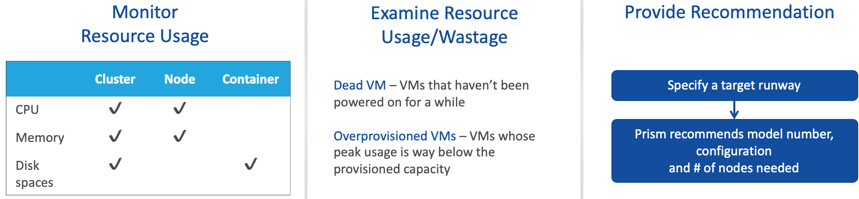
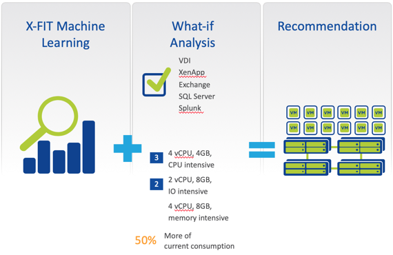

.. _what_is_prism_pro:

---------------------
Prism Pro是什么
---------------------

简介
++++++++

Prism Pro是一种旨在使我们的客户IT操作变得智能和自动化的产品。如今，没有专门针对基于HCI构建的数据中心IT运营而设计的解决方案。这种类型的数据中心的基础架构是动态的，可伸缩的且性能卓越。传统的性能监控和IT OPS工具是为静态基础结构构建的。当IT管理员使用传统工具来管理HCI环境时，他们会被工具带来的复杂性和嘈杂的信号所淹没。这降低了操作的生产率，并降低了采用HCI的投资回报率。

Prism Pro采用独特的方法，可最大化基于HCI的数据中心的运营效率。首先，Prism Pro使用专用的机器学习（X-FIT）从HCI产生的大量操作数据中提取见解。 Prism Pro交付的前三个用例是容量预测和计划，VM权限大小确定和异常检测。这些用例可帮助我们的客户发现问题并以可行的信号进行浪费。其次，Prism Pro提供了一种自动化机制（X-Play），使客户能够自信地自动化其操作任务，以响应X-FIT检测到的信号。

X-Play旨在解决客户在处理自动化时遇到的第一个痛苦点-由于自动化的复杂性而担心会放大影响。与应用程序生命周期自动化的解决方案（例如Calm）不同，X-Play的目标是使管理员每天面对的简单任务自动化。为了消除恐惧并将控制权交还给管理员，X-Play采用了无代码方法，该方法已在IFTTT和Zapier等公司中得到证明，该方法易于采用且功能极为丰富。

市场上没有其他工具采用这种方法，并且具有将智能和无代码自动化相结合的能力。 X-FIT和X-Play的强大功能使客户能够真正利用HCI基础架构生成的机器数据，并高效，自信和智能地操作它。

Prism Pro
+++++++++

Prism Central 报告管理和机器学习能力
.............................................................

通过PC Machine Learning，您可以：

-分析一段时间内的资源使用情况。
-监视资源消耗。
-识别异常行为。
-利用指导性资源计划。

使用报表管理，您可以：

-配置并提供包含有关基础结构资源信息的历史报告。
-根据您配置的时间表，将基础架构的运营洞察力延伸到您的邮箱中。

.. figure:: images/what_is_prismcentral_08.png

可行的容量预测
...............................

它是什么？

-详细的容量趋势
-智能建议
-由正在申请专利的X-FIT算法提供支持

关键点：

-随着容量的增长而实现付费
-消除猜测

.. figure:: images/what_is_prismcentral_09.png

Capacity Runway
...............................

Capacity Runway = 工作负载用尽之前的时间

Capacity 优化建议
....................................

.. figure:: images/what_is_prismcentral_14.png

Just-In-Time 预测
.....................

它是什么？

-基于机器学习的预测，预测容量扩展以适应未来的工作量增长
-根据现有/新的工作量需求规划扩展
-由X-FIT提供支持

优点：

-预定义的工作负载友好输入可节省计划时间并避免麻烦
-随着容量的增长而实现付费
-消除猜测

规划 Just-In-Time 扩展
...................................

调整容量扩展以满足未来的工作量增长

-由机器学习提供支持
-专为按需购买而设计
-简化了工作负载的输入

.. figure:: images/what_is_prismcentral_13.png

一键式集中式集群升级
.....................................

-直接从Entity Explorer中为一个或多个集群进行一键式AOS升级
-如果选择了多个群集，则可以进行滚动升级或同时升级的选项
-通过使管理员能够从一个点管理所有群集的AOS升级来简化管理

丰富而有见地的分析
.............................

.. figure:: images/what_is_prismcentral_11.png
